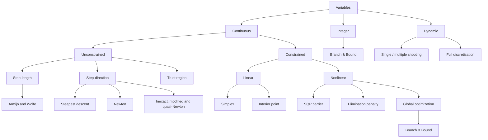
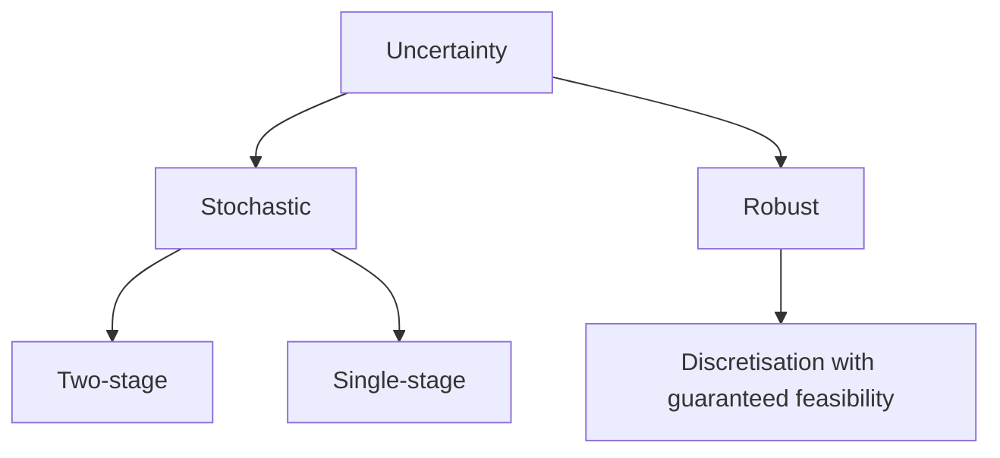

# [Mathematical Optimization for Engineers](https://www.edx.org/learn/math/rwth-aachen-university-mathematical-optimization-for-engineers)

## Mathematical basics of optimization

Optimisation is particularly useful when there are **tradeoffs** in a system.

The formulation of an optimisation problem consists of:

$$\min_{\bm{x} \in \mathcal{D}}{f(\bm{x})} \quad \text{s.t.} \quad c_i(\bm{x}) = 0, i \in E, c_i(\bm{x}) \leq 0, i \in I$$

- **Variables** (/ decision variables, degrees of freedom, parameters) $\bm{x} = [x_1, x_2, \dots, x_n]^T \in \mathcal{D} \subseteq \mathbb{R}^n$, where $\mathcal{D}$ is called the host set.
- **Objective** function $f: \mathcal{D} \rarr \mathbb{R}$.
- **Constraints** $c_i: \mathcal{D} \rarr \mathbb{R} \forall i \in E \cup I$, where $E, I$ are the index sets of equality and inequality constraints respectively:
  - Mathematical model for the description of the system to be optimised.
  - Additional restrictions on the optimal solution, incl. bounds of the variables.

Problem **formulation** makes a big difference:

- Fixed cells:
  - Advantage: easy to optimise.
  - Disadvantages: less flexibility, many discrete variables.
- Continuous positions:
  - Advantage: most flexibility.
  - Disadvantages: difficult to optimise, many continuous variables.
- Patterns:
  - Advantage: few variables.
  - Disadvantages: less flexibility, complex areas difficult to optimise.

Steps:

1. Determine variables of interest.
2. Define optimality criteria: objective function(s) and (additional) constraints.
3. Formulate a mathematical model of the system and determine the degrees of freedom (incl. their nature and number).
4. Identify the problem class: LP, QP, NLP, MINLP, OCP, etc.
5. Select or develop a suitable algorithm.

**Linear regression**: an unconstrained optimisation problem; coefficients of the fitted line are the degrees of freedom; objective is to minimise the _absolute difference_ between predicted and measured values. Problem: $f(x) = \lvert x \rvert$ is convex and continuous but it is not differentiable (at $x = 0$).

**Trajectory problems** are challenging because the degrees of freedom are functions of time.

**Symmetries**, e.g. variable symmetries, with $n$ variables result in $n!$ patterns with the same objective value.

The constraints and the host set define the **feasible set**, $\Omega$, of all possible solutions:

$$\min_{\bm{x} \in \Omega}{f(\bm{x})}, \quad \Omega = \{ \bm{x} \in \mathcal{D} \mid c_i(\bm{x}) = 0, i \in E, c_i(\bm{x}) \leq 0, i \in I \}$$

An optimal solution can lie in the interior or on the boundary of the feasible set.

- A point $x^*$ is a **local solution** if $x^* \in \Omega$ and a neighbourhood $N(x)$ exists s.t. $f(x^*) \leq f(x) \forall x \in N(x) \cap \Omega$.
- A point $x^*$ is a **strict local solution** if $x^* \in \Omega$ and a neighbourhood $N(x)$ exists s.t. $f(x^*) < f(x) \forall x \in N(x) \cap \Omega$.
- A point $x^*$ is a **global solution** if $x^* \in \Omega$ and $f(x^*) \leq f(x) \forall x \in \Omega$.

If $f: \mathcal{D} \rarr \mathcal{R}$ is a multi-variate scalar function, its **directional derivative** is a scalar quantity: the dot product of the gradient and the direction vector, $D(f(\bm{x}), \bm{p}) = \nabla f(\bm{x})^T \bm{p}$. For example, the directional derivative of $f: \mathbb{R}^2 \rarr \mathbb{R}, f(\bm{x}) = x_1^2 + x_2^2$ at $(0, 0)^T$ in the direction $(1, 1)^T$ is $(2 x_1, 2 x_2) (1, 1)^T = (0, 0) (1, 1)^T = 0$.

Example of **necessary and sufficient conditions** in set notation:

- $x \in A$ is necessary for $x \in A \cap B$, $x \in A$ is necessary for $x \in A \cap B$.
- $x \in A \cap B$ is sufficient for $x \in A$, $x \in A \cap B$ is sufficient for $x \in B$.
- $(x \in A) \cap (x \in B)$ is both necessary and sufficient for $x \in A \cap B$.

A set $\Omega \subseteq \mathbb{R}^n$ is **convex** if $\forall x_1, x_2 \in \Omega$ and $\forall \alpha \in [0, 1], \alpha x_1 + (1 - \alpha) x_2 \in \Omega$; that is, if the _secant_ between any two points lies above the graph of the function.

| $f$ is                     | $H(x)$ is              | all $\lambda_k$ are  | $\forall p \in \mathbb{R}^n, p^T H(x) p$ is |
| -------------------------- | ---------------------- | -------------------- | ------------------------------------------- |
| strictly convex            | positive definite      | $> 0$                | $> 0$                                       |
| convex                     | positive semi-definite | $\geq 0$             | $\geq 0$                                    |
| strictly concave           | negative definite      | $< 0$                | $< 0$                                       |
| concave                    | negative semi-definite | $\leq 0$             | $\leq 0$                                    |
| neither convex nor concave | -                      | $\geq 0$ or $\leq 0$ | $\geq 0$ or $\leq 0$                        |

The optimisation problem $\min_{\bm{x} \in \Omega}{f(\bm{x})}$ is convex if the objective function $f$ is convex and the feasible set $\Omega$ is convex.

## Unconstrained optimization

$$\Omega = \mathbb{R}^n \quad \text{s.t.} \quad \min_{\bm{x} \in \mathbb{R}^n}$$

**First-Order Necessary Conditions (FONC) Theorem**: Let $f$ be continuously differentiable and let $\bm{x}^* \in \mathbb{R}^n$ be a local minimiser of $f$, then $\nabla f(\bm{x}^*) = \bm{0}$. Then $\bm{x}^*$ is called a _stationary point_ of $f$.

This condition is a _necessary_ but _not sufficient_ condition for a local minimum - it may be a minimum, maximum, or saddle point. For example, $f(x) = - x^2$ possesses its only stationary point at $x^* = 0$, as $\nabla f(x^*) = - 2 x^* = 0$, but it is a (global) maximum.

**Second-Order Necessary Conditions (SONC) Theorem**: Let $f$ be twice continuously differentiable and let $x^* \in \mathbb{R}^n$ be a local minimiser of $f$, then:

1. $\nabla f(x^*) = \bm{0}$.
2. $\nabla^2 f(x^*)$ is positive semi-definite.

These conditions are _necessary_ but _not sufficient_ for a local minimum - it may be a minimum, maximum, or saddle point.

**Sufficient Optimality Conditions (SOC) Theorem**: Let $f$ be twice continuously differentiable and let $x^* \in \mathbb{R}^n$, then $x^*$ is a _strict local minimiser_ of $f$ if:

1. $\nabla f(\bm{x}^*) = \bm{0}$.
2. $\nabla^2 f(\bm{x}^*)$ is positive definite.

These conditions are _sufficient_ but _not necessary_!

The first-order necessary conditions exclude non-stationary points. The second-order necessary conditions exclude some saddle points and some local maxima, but not all.

### Iterative descent and convergence

There are direct and indirect unconstrained optimisation method:

- Indirect methods set up the _optimality conditions_, e.g. gradient equal to zero, $\nabla f(x) = 0$, in the case of unconstrained optimisation, which is a square nonlinear system of equations that can be solved analytically or numerically e.g. with Newton's method - an indirect solution method.
- Direct methods, incl. line search and trust-region methods, find the optimal solution directly by improving the objective function via _iterative descent_.
  - The _convergence_ rate may be linear or super-linear (e.g. in log scale).

#### Line search methods

A vector $\bm{p}$ is called the _descent direction_ at $\bm{x}^{(k)}$ if $\nabla f(\bm{x}^{(k)})^T \bm{p} < 0$ holds.

1. Choose a descent direction.
2. Determine a step length $\alpha_k$ s.t. $\min_{\alpha > 0}{\phi(\alpha)}$, where $\phi(\alpha) = \bm{x}^{(k)} + \alpha_k \bm{p}^{(k)}$ following the Armijo and Wolfe condition.
3. Set $\bm{x}^{(k+1)} = \bm{x}^{(k)} + \alpha_k \bm{p}^{(k)}$.

A drawback of Armijo's rule is that as $0 < c_1 < 1$ and $\frac{\partial \phi}{\partial \alpha} < 0$ the rule is always satisfied for a sufficiently small step length - which is bad for optimization. By adding a second condition to Armijo's, Wolfe's conditions prevent $\alpha$ from becoming too small, guaranteeing a minimum step length.

**Steepest descent** is based on the Taylor series expansion of a function.

**Newton's method** also uses a Taylor series expansion up to the quadratic term, the Hessian. It uses a step length equal to one. The advantage of Newton's method is very fast convergence. The disadvantages are that it does not guarantee global (only local) convergence, it requires the Hessian of the objective function to be positive definite for all iterations, and it requires computation and inversion of the Hessian - which is computationally expensive.

**Inexact Newton method**: It uses a step length not equal to one, computes an approximate descent direction to avoid solving the linear system, and requires the Hessian of the objective function to be positive definite for all iterations.

**Modified Newton method**: It modifies the Hessian by using an approximation so that it is always positive definite, and it guarantees descent at each iteration.

**Gauss-Newton method**: It ignores computing the individual residual Hessians, and it exploits the structure of least squares problems.

#### Trust-region methods

For each iteration, a trust region radius is chosen. Then the optimisation problem is solved.

It minimizes a quadratic approximation of the objective function like Newton’s method. Unlike line search, a step length is chosen first and then the step direction.

## Constrained optimization

### Equality constraints

$$\text{Lagrangian } L(\bm{x}, \lambda) = f(\bm{x}) + \lambda c(\bm{x})$$

$$\min_{\bm{x}}{f(\bm{x})} \, \text{ s.t. } \, c(\bm{x}) = 0$$

The first-order necessary optimality conditions $\nabla L(\bm{x}, \lambda) = \begin{bmatrix}
  \nabla_x L(\bm{x}, \lambda) \\ \nabla_y L(\bm{x}, \lambda)
\end{bmatrix} = \bm{0}$ give a system of equations:

- Stationarity: $\nabla_x L(\bm{x}, \lambda) = \nabla f(\bm{x}) + \lambda \nabla c(\bm{x}) = \bm{0}$.
- Primal feasibility: $\nabla_y L(\bm{x}, \lambda) = c(\bm{x}) = 0$.

### Inequality constraints

First-order necessary optimality conditions:

- Stationarity condition: $\nabla f(\bm{x}) + \lambda \nabla c(\bm{x})$.
- Primal feasibility: $c(\bm{x}) \leq 0$.
- Complementarity condition: $\lambda c(\bm{x}) = 0$.
- Dual Feasibility: $\lambda \geq 0$.

### KKT conditions of optimality

$$\min_{\bm{x} \in \mathbb{R}^n}{f(\bm{x})} \, \text{ s.t. } \, c_i(\bm{x}) = 0, i \in E, \, c_i(\bm{x}) \leq 0, i \in I$$

Let $\bm{x}^* \in \mathbb{R}^n$ be a local minimiser. Assume $\nabla c_i(\bm{x}^*), i \in A(\bm{x}^*)$ are linearly independent. Then there exist Lagrange multipliers $\lambda_i^*, i \in E \cup I:$

- Stationarity: $\nabla f(\bm{x}^*) + \sum_{i \in E \cup I}{\lambda_i^* \nabla c(\bm{x}^*)} = \bm{0}$.
- Primal feasibility: $c_i(\bm{x}^*) = 0, \forall i \in E$.
- Primal feasibility: $c_i(\bm{x}^*) \leq 0, \forall i \in I$.
- Dual feasibility: $\lambda_i^* \geq 0, \forall i \in I$.
- Complementary slackness: $\lambda_i^* c_i(\bm{x}^*) = 0, \forall i \in I$.

The KKT conditions state that, at the optimum, it is not possible to find a search direction such that the objective function decreases further and feasibility is retained - the optimum is the minimal feasible objective.

In general, the KKT conditions are _necessary_ conditions of optimality for constrained problems.

The _standard form_ of an LP writes the LP and KKT conditions in vector notation.

### Linear optimization / programming (LP)

The **feasible set** of an LP is always a _convex polytope_.

- If an LP has a unique solution, it is a corner point on the feasible set.
- If it is a boundary of the feasible set, there are infinitely many solutions.
- If the objective is unbounded (i.e. infinite), there is no solution.
- If the constraints are infeasible, there is no solution.

Excluding infeasible and unbounded sets, at least one solution exists.

#### Simplex method

In every iteration, the Simplex algorithm moves from one corner of the polytope to a neighbouring corner such that the objective function decreases by most.

It terminates when the Lagrange multipliers of all inequality constraints are $\geq 0$.

#### Duality

For every primal problem, there exists a dual problem. The dual of the dual is the primal.

Dual and primal problems share optimality conditions.

All LPs show strong duality.

#### Interior point methods

Newton's method is modified within the primal-dual method for LPs by introducing a centering parameter to enable larger step lengths.

The Primal-Dual method is an interior point method because both primal and dual inequality constraints are strictly satisfied.

#### LP solvers

The simplex method has average-case polynomial complexity. Interior point methods have worst-case polynomial complexity. Still, for most LPs in practice, the simplex method tends to outperform most interior point methods.

## Nonlinear optimization

### Quadratic programs

### General nonlinear constrained optimization

### Penalty method

### Log-barrier

### Sequential quadratic programming (SQP)

### Mixed-integer optimization

#### Branch and bound method for mixed-integer linear problems

Branch-and-bound is a deterministic method that guarantees an optimal solution in a finite number of iterations. It relies on multiple heuristics.

It is applicable to all functions: linear, convex nonlinear, nonconvex nonlinear; and is the basis for many solvers.

1. Branching step: create two sub-problems. Children inherit the lower bound from the parent. Variable selection is a heuristic choice.
2. Bounding step: relax free binary variables.

## Global optimization

So far, there was no guarantee that we found a globally optimal solution. This can be problematic when working with non-convex problems. Therefore, this week we will learn deterministic global optimization, which can guarantee a global optimum. We will also look at some stochastic methods for global optimization.

### Branch and bound method for nonlinear non-convex problems

### Relaxations

### Convergence rate

### Deterministic global solvers

### Stochastic global optimisation

Black-box methods.

### Global heuristic genetic algorithms

Start with an initial population (i.e. initial guesses). At each iteration the size remains fixed.

- Generate new members by _mutation_: perturb entries randomly.
- Generate new members by _crossing_ (recombination): child inherits some entries from parents.

Practical recommendations:

- Parallelise with MPI: master process for algorithm, worker processes for function evaluation.
- Hybridise with deterministic solver: run local solver for promising points.
- Termination criteria: # iterations, small improvement in objective function.
- Plethora of variants: picking best algorithm solver is hard. Alternatives:
  - Take existing solver and tune. Advantage: no need to reinvent the wheel.
  - Implement basic solver and tune to problem. Advantage: fewer problems with compatibility (OS, etc.).
- Visits many points - can be used to generate proof of solutions.
  - All algorithms visit many points, hopefully qualitatively different, and on the Pareto front.
- Can be easily extended to multi-objective optimisation.

### Derivative free methods

For example in simulation optimisation, gradients may not be available.

## Dynamic optimization

A dynamic system is characterized by time-dependent variables and differential equations.

### Full discretization, single-shooting and multi-shooting methods

### Nonlinear model predictive control

## Machine learning for optimization

Full space vs. Reduced space (in global optimisation) applies to neural networks, which are given inputs in the full space and produce outputs in the reduced space.

Most data-driven models provide only a prediction but no information about the uncertainty of the predictions. Gaussian Processes (GPs) are a generalisation of multivariate Gaussian distributions, well suited for sparse data, that provide a prediction and variance, and can be used in Bayesian optimisation.

## Optimization under uncertainty

### Parametric optimization

### Two stage stochastic problems

### Robust optimization via semi-infinite problems
