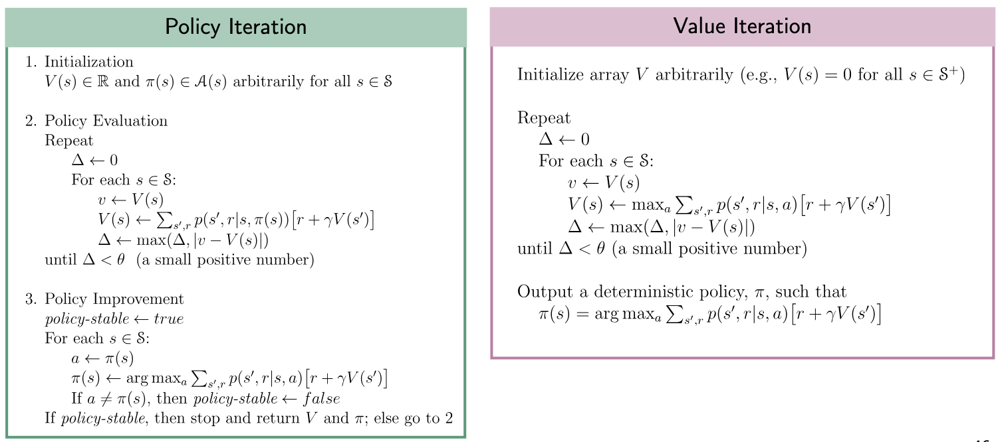
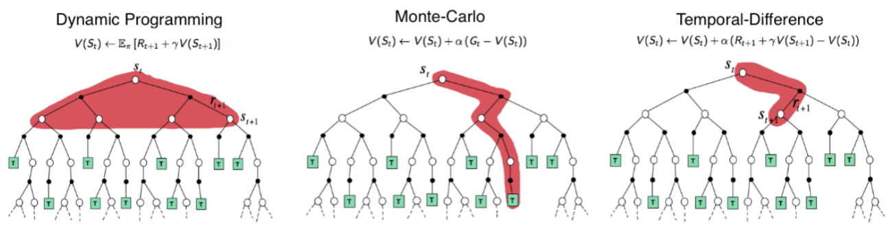

# Reinforcement Learning

\* = Continuous Action Space is possible

## 1. Introduction to Planning and Reinforcement Learning

Reinforcement learning: _Agent_ learning to achieve a goal, solve sequential decision problems, via repeated _interaction_ with the (dynamic) _environment_.

Three ways of learning a policy: planning, behavioural cloning, reinforcement learning.

- Planning problem: given a model, e.g. an MDP (we know all of its components, $(\mathcal{S}, \mathcal{A}, p)$), compute the optimal policy $\pi$. Requires a full model of the environment!
- Behavioural cloning: supervised learning of a state-action mapping by imitation learning / observing the teacher.
- RL problem: efficiently learn a high-value policy by interacting with an MDP. No learning examples!

Principle of optimality: subpath of optimal paths are also optimal for their own subproblem.

A function that gives us an action to take for a given state is called a policy.

| RL                                                                                                 | Control theory                                           |
| -------------------------------------------------------------------------------------------------- | -------------------------------------------------------- |
| State $s_t$                                                                                        | State $x_t$                                              |
| Observation $o_t$ (may be stochastic)                                                              | Observation $y_t$ (may be stochastic)                    |
| Action $a_t$                                                                                       | Input $u_t$                                              |
| Reward $r_t$                                                                                       | Stage cost $\ell(x_t, u_t)$                              |
| Episode $\tau = (s_0, a_0, \dots)$                                                                 | Trajectory $\tau = (x_0, u_0, \dots)$                    |
| Return $\max{R(\tau)} = \sum_{t \in \tau}{r_t}$                                                    | Cost $\min{J(\tau)} = \sum_{t \in \tau}{\ell(x_t, u_t)}$ |
| Model $s_{t+1} = f(s_t, a_t)$ (deterministic) / $s_{t+1} \sim p(\cdot \mid s_t, a_t)$ (stochastic) | Dynamics $x_{t+1} = f(x_t, u_t)$                         |

A partially-observable Markov decision process (POMDP) is a typical model of the environment.

**Reward hypothesis**: All goals can be described by the maximisation of the expected value of cumulative scalar rewards. (Reward is enough, Silver et al., 2021)

- Manage investment portfolio: reward?
- Make humanoid robot walk: reward?

Elements of a RL System:

- Reward signal (given)
- Policy (learned)
- Value function (learned): state value = discounted cumulative reward (with a discount factor)
- Model (of the environment; learned)

The use of value functions distinguishes (classical) RL from evolutionary methods that search directly in policy space guided by evaluations of entire policies. In practice, many modern policy-based methods (such as actor-critic algorithms) combine both approaches: they use a value function (the "critic") to reduce variance and improve learning efficiency, but the primary object being optimized is the policy itself.

### 1.2. Scope and Limitations

Machine Learning = improving performance with experience (data).

- In supervised learning, the training signal is _instructive_, i.e. "which is the correct action, independently of the one taken?"
- In RL, the training signal is **evaluative**, i.e. "how good is the action taken?", and can only be learned by trial and error.

Key challenges:

- _Unknown environment_: How do actions affect environment state and rewards?
- _Exloration-exploitation dilemma_.
- _Delayed rewards_: Which prior action(s)' long-term consequences led to the reward?

### 1.4. History of RL

1. Animal learning, trial and error
2. Optimal control: minimise a measure of a dynamical system's behaviour over time
3. TD methods: difference between temporally successive estimates of the same quantity $V(S_{t+1}) - V(S_t)$

## 2. Multi-Armed Bandits (MAB)

Simplest RL problem: the **Multi-Armed Bandit Problem**:

- Given: a set of $k$ actions, $\mathcal{A}$, the agent can take, rewards from the environment distributed according to a **stationary** _probability distribution_, $p(r \mid a)$ number of rounds $T$.
- Repeat for $t$ in $T$ rounds:
  1. Algorithm selects arm $A_t \in \mathcal{A}$.
  2. Algorithm observes reward $R_t \in [0, 1]$.
- Goal: maximise expected long-term total reward.
  - Value of arm: expected reward given action taken $q_*(a) \doteq \mathbb{E}[R_t \mid A_t = a] \, \big(= \sum_r{p(r \mid a) r} \big)$.
  - If we knew the action values with certainty, we would select the action with the maximal value. The true value $q_*$ is unknown to the agent, so compute _estimates_ $Q_t(a)$.

### 2.2. Action-value methods

An action-value method requires two tasks:

1. How to _estimate the values_ of actions, i.e. how to compute $Q_t(a)$.
2. How to use the estimates to make an _action selection decision_, i.e. given $Q_t(a)$ how to select $A_t$.
   - Pure greedy.
   - $\epsilon$-greedy.
   - UCB.

**1. Sample-Average Estimation Method**: Estimate the value of each arm:

$$Q_t(a) \doteq \frac{\text{sum of the rewards when } a \text{ taken prior to } t}{\text{number of times } a \text{ taken prior to } t} = \frac{\sum_{i=1}^{t-1}{R_i \mathbb{1}_{A_i = a}}}{\sum_{i=1}^{t-1}{\mathbb{1}_{A_i = a}}}$$

Same equation, different notation:

$$Q_t(a) = \frac{1}{N_t(a)} \sum_{\tau = 1}^{t-1}{R_\tau \cdot \mathbb{1}_{A_t = a}}$$

_Sample averages converge in the limit_: $\lim_{N_t(a) \rarr \infty}{Q_t(a)} = q_*(a)$.

**2. ($\varepsilon$-)Greedy Action Selection Method**: Select the best action $A_t$ given action-value estimates $Q_t(a)$:

- Exploitation: Pick best option so far - Greedy action selection $A_t = A_t^* \doteq \argmax_a{Q_t(a)}$.
- Exploration: Learn more about other options - Random action selection $A_t \sim \text{Unif}(\mathcal{A})$.

**Exploration-Exploitation Dilemma**:

- Exploiting, i.e. selecting the maximal action value, is the right thing to do to maximise the expected reward at the current time step.
- Exploring is the right thing to do to maximise the expected reward _in the long run_ - but requires _time_.

Pursuing only one = failure. The more time you have, the more you can afford to explore - but there is no right answer.

$\epsilon$**-Greedy Action Selection Algorithm** (greedy: $\epsilon = 0$; optimism = set $Q_1$ high, realism = $Q_1 = 0$):

- $Q_1(a), N_1(a) = 0, \, \forall a \in \mathcal{A}$
- For each round $t$ in $T$:
  - $A_t = \begin{cases}A_t^* & \text{Pr } 1 - \epsilon \\ \text{Unif}(\mathcal{A}) & \text{otherwise} \end{cases}$
  - Execute $A_t$, observe $R_t$.
  - Update $N_t(a), Q_t(a)$.

### 2.4. Incremental implementation

**Incremental Learning Rule** - more computationally efficient: Sample average $Q_n = \frac{R_1 + R_2 + \dots + R_{n-1}}{n-1}$ (focusing on a single action, inefficient) can instead be computed incrementally to avoid recomputing:

$$Q_{n+1} = Q_n + \frac{1}{n} [R_n - Q_n]$$

(This is the standard form for update rules in RL: NewEstimate <- OldEstimate + StepSize[Target - OldEstimate].)

### 2.5. Tracking Non-Stationary Problems

**Non-Stationary Problems**: Suppose the true _action values shift over time_ (like in the real world). Sample average alone is no longer appropriate (why? because they weigh all past rewards equally, regardless of how much the environment has changed over time.). We should weight more recent rewards higher!

Solution: **Exponential recency-weighted average method**: instead of using the average (from the sample average), track action values using a _constant step-size parameter_ $\alpha \in (0, 1]$: $Q_{n+1} \doteq Q_n + \alpha [R_n - Q_n]$ and unrolling $Q_{n+1} = \alpha R_n + (1 - \alpha) \alpha R_{n-1} + (1 - \alpha)^2 \alpha R_{n-2} + \dots$. Recent rewards are exponentially more important!

**Stochastic Approximation Convergence Conditions**: Estimates $Q_n$ will converge with probability $1$ to $q_*$ if $\sum_{n=1}^\infty{\alpha_n(a)} \rarr \infty$ and $\sum_{n=1}^\infty{\alpha_n^2(a) < \infty}$.

- Conditions hold: $\alpha_n = \frac{1}{n}$.
- Conditions don't hold: $\alpha_n = c, \alpha_n = \frac{1}{n^2}$.

### 2.6. Optimistic initial values

In initial estimates, overestimate actual rewards that can be obtained - unexplored states will have a higher value than explored ones and be selected more often.

Effective in stationary problems.

### 2.7. Upper Confidence Bounds (UCB)

- Greedy action-selection selects actions that look best now but does not explore actions that could be better in the long run.
- $\epsilon$-greedy action selection tries also non-greedy actions but it explores _indiscriminately_.
- UCB favors more uncertain actions - according to their _potential of being optimal_.

**UCB Action-Selection Algorithm**: Takes into account both _optimality_ (i.e. it is greedy) and _uncertainty_ (i.e. if actions were not explored enough yet) of action values.

- $Q_1(a), N_1(a) = 0, \, \forall a \in \mathcal{A}$
- For each round $t$ in $T$:
  - $A_t = \begin{cases}\text{Unif}(\mathcal{A}) & \max_a{N_t(a) = 0} \\ \argmax_a{\bigg[Q_t(a) + c \sqrt{\frac{\ln{t}}{N_t(a)}}\bigg]} & \text{otherwise} \end{cases}$
  - Execute $A_t$, observe $R_t$.
  - Update $N_t(a), Q_t(a)$.

Note:

- The uncertainty $\sqrt{\frac{\ln{t}}{N_t(a)}}$ is
  - reduced each time we select $a$: $N_t(a) = N_{t-1}(a) + 1$.
  - increased each time another action is selected: same $N_t(a)$ but $\ln{t}$ increases.
- $c$ is the confidence on this upper bound; $c = 0$ is equivalent to being greedy.

The square-root term is a measure of the uncertainty or variance in the estimate of a's value. The quantity being max'ed over is thus a sort of upper bound on the possible true value of action a, with c determining the confidence level: Estimate + (positive) uncertainty $\approx$ upper bound.

When the uncertainty of an action $a$'s value is high, UCB considers $a$ to potentially have a higher true value than its current estimate.

### 2.8. Gradient bandit algorithms

so far we estimate action values (q-values) and use these to select actions.

here we compute a numerical preference for each action, and select the action with a softmax.

Algorithm based on stochastic gradient ascent: on each step, after selecting action At and receiving reward Rt, the action preferences are updated

### 2.9. Associative search

at each time step the bandit is different. learn a different policy for different bandits

## 3. Markov Decision Processes (MDPs)

- Everything inside the agent is completely known and controllable
- Everything outside the agent is incompletely controllable and may or may not be completely known
- The Bellman equations express $v_\pi$ and $q_\pi$
- The Bellman optimality equations express $v_*$ and $q_*$, following the optimal policy
- Need for approximated solutions

### 3.1. Agent-Environment Interface

_Bringing State Back_: The **Agent-Environment Interface**: Agent and environment interact at discrete time steps $t = 0, 1, 2, 3, \dots$:

- The best action for the agent may depend on the state.
- The actions may influence future states and rewards.

Markov Decision Processes $(\mathcal{S}, \mathcal{A}, p, r)$ - the canonical way to model RL problems:

- Policy $\pi(a \mid s)$ - a strategy for assigning actions to states.
- Discount factor $\gamma \in [0, 1)$.
- Return $G_t = \sum_{k=0}^\infty{\gamma^k R_{t+1+k}}$.
- Long term view of the quality of a policy: Value $v_\pi(s)$ and Action-value $q_\pi(s, a)$ capture expected cumulative discounted reward:
  - State-value $v_\pi(s) = \mathbb{E}_\pi[G_t \mid S_t = s]$.
  - Action-value $q_\pi(s, a) = \mathbb{E}_\pi[G_t \mid S_t = s, A_t = a]$.
- Goal: Find a policy that maximises value.

The RL **environment** with an MDP is characterised completely by: transition function $p(s' \mid s, a)$ and reward function $r(s, a)$ which constitute the _dynamics_ of the MDP.

**Markov property**: Future states and rewards are independent of past states and actions, given the current state and action: state $S_t$ is a sufficient summary of interaction history.

### 3.2. Goals and Rewards

The goal of the agent is to maximize cumulative reward in the long run. We can use the reward signal to give prior knowledge about how to achieve the task.

Goals and **rewards**: Rewards indicate the goal / purpose, not the strategy; that is, rewards indicate the WHAT not the HOW. The agent otherwise could focus on the intermediate steps and forget about the real goal: winning.

A **policy** is the agent's strategy for assigning actions to states: $\pi: \mathcal{S} \rarr \mathcal{A}$ (can be stochastic too). The _goal_ is to find a policy that maximises expected cumulative reward. The _value_ $v_\pi(s)$ and _action-value_ $q_\pi(s, a)$ capture the expected cumulative discounted reward.

### 3.3. Returns and Episodes: episodic and continuous cases

Episodic returns: actions naturally break into sequences where there is a terminal time step $T$ s.t. $G_t = R_t + R_{t+1} + \dots + R_T$.

Continuous: $G_t = R_{t+1} + \gamma R_{t+2} + \gamma^2 R_{t+3} + \dots = \sum_{k=0}^\infty{\gamma^k R_{t+k+1}} = R_{t+1} + \gamma ( R_{t+2} + \gamma R_{t+3} + \dots ) = R_{t+1} + \gamma G_{t+1}$. ($\gamma = 0$ = the agent is myopic)

### 3.4. Unified notation for episodic and continuing tasks

The return over a finite number of terms of the episodic case can be treated as the infinite sum by adding an absorbing state (i.e. $R_\text{absorb} = R_{\text{absorb} + 1} = 0$):

$$G_t = \sum_{k=t+1}^T{\gamma^{k-t-1} R_k}$$

This includes the possibility of $T = \infty$ or $\gamma = 1$.

### 3.5. Policies and value functions: Bellman equations for $v_\pi(s)$ and for $q_\pi(s, a)$

An MDP is controlled with a **policy**: $\pi(a \mid s)$ is the probability of selecting $a$ when in state $s$ under policy $\pi$.

- Special case: deterministic policy $\pi(s) = a$, e.g. hard-coded state-actions `high -> search, low -> recharge`.
- An MDP coupled with a fixed policy $\pi$ is a _Markov chain_.

The **state-value function** $v$ of a state $s$ under a policy $\pi$, $v_\pi$, is the expected return when starting in $s$ at timestep $t$ and following $\pi$ from there on:

$$v_\pi(s) \doteq \mathbb{E}_\pi[G_t \mid S_t = s] = \mathbb{E}_\pi\bigg[ \sum_{k=0}^\infty{ \gamma^k R_{t+k+1} \mid S_t = s } \bigg]$$

If we want to evaluate a policy, we compute its value functions!

Agent's goal is to learn a policy that maximises cumulative reward.

- Assuming _terminating episodes_, e.g. can enforce termination by setting number of allowed time steps.
- For non-terminating (infinite) episodes, can use **discount rate** $\gamma \in [0, 1)$, e.g. financial portfolio management, one cookie now or many later?
  - Low $\gamma$ is shortsighted.
  - High $\gamma$ is farsighted.
  - A reward received $k$ timesteps in the future is only worth $\gamma^{k-1}$ times what it would be worth if it was received immediately.

$$G_t \doteq \sum_{k=0}^\infty{\gamma^k R_{t+1+k}}$$

This sum is _finite_ for $\gamma < 1$ and _bounded_ for rewards $R_t \leq r_\text{max}$:

$$\sum_{k=0}^\infty{\gamma^k R_{t+1+k}} \leq r_\text{max} \sum_{k=0}^\infty{\gamma^k} = r_\text{max} \frac{1}{1 - \gamma}$$

And the definition also works for terminating episodes if terminal are **absorbing**: an absorbing state always transitions into itself and gives reward zero (see [3.4.](#34-unified-notation-for-episodic-and-continuing-tasks)).

By virtue of the Markov property, the **state-value** and **action-value** functions can be written in recursive form (i.e. a look-ahead tree):

$$
v_\pi(s) \doteq \mathbb{E}[G_t \mid S_t = s]
= \sum_a{ \pi(a \mid s) \sum_{s', r}{ p(s', r \mid s, a) [r + \gamma v_\pi(s')] } }
$$

$$q_\pi(s, a) \doteq \mathbb{E}_\pi[G_t \mid S_t = s, A_t = a] = \sum_{s', r}{ p(s', r \mid s, a) [r + \gamma v_\pi(s')] }$$

Both equations represent the sum of the _immediate reward plus the discounted expected future value_ ($\mathbb{E}_{s'}[v_\pi(s')] = \sum_{s' \in \mathcal{S}}{ p(s' \mid s, a) \cdot v_\pi(s') }$):

$$v_\pi(s) = \sum_{a \in \mathcal{A}}{\pi(a \mid s) r(s, a) + \gamma \sum_{s' \in \mathcal{S}}{ p(s' \mid s, a) \cdot v_\pi(s') }}$$

$$q_\pi(s, a) = r(s, a) + \gamma \sum_{s' \in \mathcal{S}}{ p(s' \mid s, a) \cdot v_\pi(s') }$$

The Bellman equation express a relationship between the value of a state the values of its successor states. It can be visualised with a _backup diagram_. It's called backup diagram because they visualize the operations that transfer values back to a state from its successor states.

### 3.6. Optimal values and optimal policies

**Bellman optimality equations**: A policy $\pi$ is optimal if (can be expressed without reference to policy):

$$
v_\pi(s) = v_*(s) = \max_{\pi'}{v_{\pi'}(s)}
= \max_a{ \sum_{s', r}{ p(s', r \mid s, a) [r + \gamma v_*(s')] } }
$$

$$q_\pi(s, a) = q_*(s, a) = \max_{\pi'}{q_{\pi'}(s, a)} = \sum_{s', r}{ p(s', r \mid s, a) [r + \gamma \max_{a'}{q_*(s', a')}] }$$

By the Bellman Equation, this implies that for any optimal policy:

$$\pi \geq \pi' \text{ iff } \forall \pi', s: v_\pi(s) \geq v_{\pi'}(s)$$

What can be said about the value, $v_\pi(s)$ of a policy $\pi$ when $\gamma=0.5$ vs. $\gamma=0.9$? When are they equal, if ever?

- With $\gamma=0.5$, future rewards are discounted more aggressively. The agent focuses more on immediate rewards and less on long-term returns.
- With $\gamma=0.9$, the agent considers long-term rewards more significantly. A higher $\gamma$ generally leads to a larger $v_\pi(s)$, assuming rewards are positive.
- If all future rewards beyond the immediate step are zero, then $\gamma$ has no effect, and the value functions are equal: This happens in episodic tasks that end immediately.

The Bellman optimality equation for $v_\pi$ forms a system of $n = \lvert \mathcal{S} \rvert$ linear equations with $n$
variables (for finite MDPs): $v_\pi(s_1) = \dots, v_\pi(s_2) = \dots, \dots, v_\pi(s_n) = \dots$

- The optimal value function $v_\pi$ is the unique solution to the system - if MDP is finite.

The Bellman optimality equation for $v_∗$ forms a system of $n$ non-linear equations with $n$ variables (for finite MDPs):

- Equations are non-linear due to the $\max$ operator.
- The optimal value function $v_∗$ is the unique solution to the system.

Have we solved RL? We are making assumptions:

- that we knoew the dynamics of the environment $p(s', r \mid s, a)$,
- that we have engouh computational power

DP, for example, provides an approximate solution to the Bellman equations.

### 3.7. Optimality and approximation

In a practical setting we almost always have to settle for an approximation. But we can do this in a clever way: making approximate optimal policies that play nearly optimally in regions of the state space that are actually encountered, at the expense of making very poor decisions in the states that have a very low probability of occuring.

### 3.8. Ergodicity, Discounting and Average Reward

For finite MDPs and non-terminating episodes, any policy $\pi$ will produce an **ergodic** set of states $\hat{\mathcal{S}}$:

- Every state in $\hat{\mathcal{S}}$ is visited infinitely often.
- Steady-state distribution $P_\pi(s) = \lim_{t \rarr \infty}{ \text{Pr}\{ S_t = s \mid A_0, \dots, A_{t-1} \sim \pi \} }$.

Policy performance can be measured by **average reward**, independent of initial state $S_0$!

$$
r(\pi) \doteq \lim_{h \to \infty} \frac{1}{h} \sum_{t=1}^{h} \mathbb{E} [ R_t \mid S_0, A_0, ..., A_{t-1} \sim \pi]
= \sum_{s} P_{\pi}(s) \sum_{a} \pi(a | s) \sum_{s', r} p(s', r | s, a) r
$$

Maximising discounted return over the steady-state distribution is the same as maximising average reward - $\gamma$ has no effect on the maximisation!

$$\sum_{s} P_{\pi}(s) v_{\pi}(s) = \sum_{s} P_{\pi}(s) \sum_{a} \pi(a | s) \sum_{s',r} p(s', r | s, a) [r + \gamma v_{\pi}(s')]$$

$$= r(\pi) + \sum_{s} P_{\pi}(s) \sum_{a} \pi(a | s) \sum_{s',r} p(s', r | s, a) [\gamma v_{\pi}(s')]$$

$$= r(\pi) + \gamma \sum_{s'} P_{\pi}(s') v_{\pi}(s')$$

$$= r(\pi) + \gamma \left[ r(\pi) + \gamma \sum_{s'} P_{\pi}(s') v_{\pi}(s') \right]$$

$$= r(\pi) + \gamma r(\pi) + \gamma^2 r(\pi) + \gamma^3 r(\pi) + \cdots$$

$$= r(\pi) \frac{1}{1 - \gamma} \quad \Rightarrow \quad \gamma \text{ has no effect on maximisation!}$$

Focus on discounted returns:

- Most of current RL theory was developed for discounted returns.
- Discounted and average return settings both give the same limit results for $\gamma \rarr 1$, which is why people often use $\gamma \in [0.95, 0.99]$.
- Discounted returns work well for finite and infinite episodes.

Tsitsiklis, J., Van Roy, B. (2002). On Average Versus Discounted Reward Temporal-Difference Learning. Machine Learning 49, 279-191.

## 4. Dynamic Programming

- Dynamic = problems of a _sequential_ nature (e.g. time).
- Programming = finding optimal programs (i.e. _policies_).

DP is a general solution method for problems with _two properties_:

1. Optimal substructure (principle of optimality)
2. Overlapping subproblems

Are MDPs good candidates for DP? The value of a state $\textcolor{blue}{v_*(s)} = \max_a{\sum_{s', r}{p(s', r \mid s, a) [r + \gamma \textcolor{blue}{v_*(s')}]}}$ is a composition of the value of successor states, i.e. a substructure - value functions are caches of partial solutions!

Dynamic programming can be used in MDPs for:

- prediction: input MDP and policy $\pi$, output value function $v_\pi$
- control: input MDP, output optimal value function $v_∗$ and optimal policy $\pi_*$
- Assumes full knowledge of the model

_Solving_ an MDP: Use Bellman Equations to organise search for good policies.

- Given: an MDP $(\mathcal{S}, \mathcal{A}, p, r, \gamma)$.
- Output: an optimal policy $\pi_* = \argmax_\pi{v_\pi(s), \, \forall s}$.

### 4.1. Iterative Policy Evaluation (/ Prediction)

1. Initialise $v_0(s) = 0$ (can be arbitrary value functions, but terminal states must be initialised to zero).
2. Perform _expected update_ $v_k \rarr v_{k+1}$ for each state $s$:

$$v_{k+1}(s) = \sum_a{ \pi(a \mid s) \sum_{s', r}{ p(s', r \mid s, a) [r + \gamma v_k(s')] } }$$

The sequence $\{v_k\}$ converges to $v_\pi$ as $k \rarr \infty$.

### 4.2. Policy Improvement

Given a value function $v_\pi(s)$ for $\pi(a \mid s)$, which was determined with policy evaluation, compute a policy $\pi'(a \mid s)$ that is "better" than $\pi(a \mid s)$.

**Policy Improvement Theorem**: Let $\pi, \pi'$ be deterministic policies s.t. $\forall s, \, \sum_a{ \pi'(a \mid s) q_\pi(s, a) = q_\pi(s, \pi'(s)) \geq v_\pi(s) = \sum_a{ \pi(a \mid s) q_\pi(s, a) } }$.

Then $\pi'$ must at least as good or **better** than $\pi$ (i.e. it will obtain greater or equal expected return in all states $s$):

$$\forall s: v_{\pi'}(s) \geq v_\pi(s)$$

_Proof for deterministic policies_:

$$v_{\pi}(s) \leq q_{\pi}(s, \pi'(s))$$

$$= \mathbb{E}_{\pi'} \big[ R_{t+1} + \gamma v_{\pi}(S_{t+1}) \mid S_t = s, A_t = \pi'(s) \big]$$

$$= \mathbb{E}_{\pi'} \big[ R_{t+1} + \gamma v_{\pi}(S_{t+1}) \mid S_t = s \big]$$

$$\leq \mathbb{E}_{\pi'} \big[ R_{t+1} + \gamma q_{\pi}(S_{t+1}, \pi'(S_{t+1})) \mid S_t = s \big] \quad \text{(by premise)}$$

$$= \mathbb{E}_{\pi'} \big[ R_{t+1} + \gamma \mathbb{E}_{\pi'} [ R_{t+2} + \gamma v_{\pi}(S_{t+2}) \mid S_{t+1}, A_{t+1} = \pi'(S_{t+1}) ] \mid S_t = s \big]$$

$$= \mathbb{E}_{\pi'} \big[ R_{t+1} + \gamma R_{t+2} + \gamma^2 v_{\pi}(S_{t+2}) \mid S_t = s \big]$$

$$\leq \mathbb{E}_{\pi'} \big[ R_{t+1} + \gamma R_{t+2} + \gamma^2 R_{t+3} + \gamma^3 v_{\pi}(S_{t+3}) \mid S_t = s \big]$$

$$\vdots$$

$$\leq \mathbb{E}_{\pi'} \big[ R_{t+1} + \gamma R_{t+2} + \gamma^2 R_{t+3} + \gamma^3 R_{t+4} + \dots \mid S_t = s \big]$$

$$= v_{\pi'}(s)$$

_Picking the **greedy** action w.r.t._ $q_\pi(s, a)$ _in each state satisfies the condition of the theorem_:

$$q_\pi(s, \pi'(s)) = \max_a{q_\pi(s, a)} \geq \sum_a{\pi(s \mid a) q_\pi(s, a)} = v_\pi(s)$$

$$\pi'(s) = \arg\max_a{q_\pi(s, a)} $$

What if $\pi' = \pi$? $\pi'$ gives all probability to $\hat{a}$: $v_\pi(s) = \sum_a{\pi(s \mid a) q_\pi(s, a)} = q_\pi(s, \hat{a}) = \max_a{q_\pi(s, a)}$. This is the Bellman optimality equation: $v_\pi(s) = \sum_a{\pi(s \mid a) q_\pi(s, a)} = \max_a{q_\pi(s, a)} = \max_a{ \sum_{r, s'}{p(r, s' \mid a, s) [r + \gamma v_\pi(s')]} }$, i.e. the policy is optimal!

### 4.3. Policy Iteration

Given the initial policy, compute the value function, use it to compute a better policy, until convergence.

- Each policy is guaranteed to be a strict improvement of the previous one
- This process converges to an optimal policy and optimal value function in a finite number of steps (for finite MDPs)

Note: in production, we need to make sure the policy improvement doesn't switch between two equally good policies.

### 4.4. Value Iteration

Iterative policy evaluation uses Bellman equation as operator: $v_{k+1}(s) = \sum_a{ \pi(a \mid s) \sum_{s', r}{ p(s', r \mid s, a) [r + \gamma v_k(s')] } } \quad \forall s \in \mathcal{S}$. It may take many sweeps $v_k \rarr v_{k+1}$ to converge. Do we have to wait until convergence before policy improvement $\pi'(s) = \argmax_a{\sum_{r, s'}{p(r, s' \mid a, s) [r + \gamma v_\pi(s')]}}$?

Value iteration _combines_ one sweep of policy evaluation and policy improvement by using _Bellman optimality equation_ as (iterative) operator:

$$v_{k+1}(s) = \max_a{ \sum_{r, s'}{ p(r, s' \mid s, a) [r + \gamma v_k(s')] } } \quad \forall s \in \mathcal{S}$$

We know the optimal solution from the leaves and we back this up in the tree by maxing out of all the things we can do.

Sequence converges to optimal policy (can show that Bellman optimality operator is $\gamma$-contraction).

Interfacing policy evaluation (/ prediction) and policy improvement in an iterative mechanism:

### 4.5. Asynchronous DP

Performiing policy evaluation and improvement for all states is prohibitive if the state space is large.

Asynchronous DP methods evaluate and improve policy on subset of states:

- Parallelisation (on multiple processors).
- Gives flexibility to choose best states to update, e.g. random states, recently visited states (real-time DP).
  - Prioritize the selection of which state to update based to the magnitude in the Bellman equation error (more error: more priority).
- Still guaranteed to converge to optimal policy if all states in $\mathcal{S}$ are updated infinitely many times in the limit.

### 4.6. Generalised Policy Iteration (GPI)

Policy iteration, Value iteration, Asynchronous DP vary in the granularity of the interleaving between evaluation and improvement. But the idea of this interleaved process is general enough for describing most of RL.

- Process 1 - policy evaluation: make the current value function consistent with current policy
- Process 2 - policy improvement: make the policy greedy wrt the current value function
- In policy iteration, these two processes alternate
- In value iteration, they don't really alternate, policy improvement only waits for one iteration of the policy evaluation
- In asynchronous DP, the two processes are even more interleaved

Generalized policy iteration: let policy evaluation and policy improvement interact, independent of the granularity. When they stabilize, we have reached optimality.

The value function stabilizes only when it is consistent with the current policy, and the policy stabilizes only when it is greedy with respect to the current value function. Thus, both processes stabilize only when a policy has been found that is greedy with respect to its own evaluation function. This implies that the Bellman optimality equation holds, and thus that the policy and the value function are optimal.

If improvement stops, $q_\pi(s, \pi'(s)) = \max_{a \in A}{q_\pi(s, a))} = q_\pi(s, \pi(s)) = v_\pi(s)$, the Bellman equation has been satisfied: $v_\pi(s) = \max_{a \in A}{q_\pi(s, a)}$.

Both processes cooperate toward the same goal, optimality, and competing as making the policy greedy w.r.t. the value function typically makes the value function incorrect for the new policy.

### 4.7. Efficiency of DP

If $n$ and $k$ are the number of states and actions, then there are $k^n$ policies.

DP methods run in polynomial time, which is better than other methods. Policy iteration and value iteration can be used up to a fair number of states, and asynchronous DP even more.

- Policy evaluation refers to the (typically) iterative computation of the value function given a policy
- Policy improvement refers to the computation of an improved policy given the value function for current policy
- Putting these two together gives policy iteration and value iteration
- DP methods sweep through the state space, performing an expected update operation for each state
- Expected updates are Bellman equations turned into assignments to update the value of a state based on the values of all possible successor states, weighted by their probability of occurring
- GPI refers to the interleaving of policy evaluation and policy improvement to reach convergence
- Asynchronous DP frees us for the complete state-space sweep
- We update estimates of the values of states based on estimates of the values of successor states. Using other estimates to update the value of one estimate is called bootstrapping

| Problem    | Equation                                        | Algorithm                   |
| ---------- | ----------------------------------------------- | --------------------------- |
| Prediction | Bellman expectation                             | Iterative policy evaluation |
| Control    | Bellman expectation + Greedy policy improvement | Policy iteration            |
| Control    | Bellman optimality                              | Value iteration             |

Complexity is $\mathcal{O}(mn^2)$ per iteration, for $m$ actions, $n$ states, state-value function $v_\pi(s), v_*(s)$. (For action value functions would be $q\pi(s), q_*(s)$ would be $\mathcal{O}(m^2 n^2$.)

DP requires a complete model of the environment, and does bootstrapping (i.e. creating estimates out of other estimates). In the next chapter (Monte Carlo methods) we don't require any model and we don't bootstrap. In the chapter after (TD-learning) we do not require a model either but we do bootstrap.

## 5. Monte Carlo Methods

First _learning_ method for estimating value functions and discovering optimal policies. Here we don't have any knowledge of the environment dynamics, we _learn_ only by experience.

Recall: Planning model: given the model, find an optimal policy. DP solutions:

- Policy Iteration (Policy Evaluation, Bellman Expected Update, + Greedy Policy Improvement)
- Value Iteration (Bellman Optimal Update)
- Generalized Policy Iteration

DP methods iterate through policy evaluation and improvement until convergence to optimal value function $v_∗$ and policy $\pi_∗$:

- Policy evaluation via repeated application of Bellman operator.
- Requires complete knowledge of MDP model: $p(s', r \mid s, a)$.

Can we compute optimal policy without knowledge of complete model? Often, we do not have a model of the environment. We want to learn from experience, i.e. interaction with the environment. Already saw something like this in bandits: did not have access to the reward distribution $p(r \mid a)$ and estimated the values from experience with the _sample-average method_: $Q_t(a) \doteq \frac{\text{sum of the rewards when } a \text{ taken prior to } t}{\text{number of times } a \text{ taken prior to } t}$.

Monte Carlo methods:

- Solving reinforcement learning by averaging sample _returns_
  - Compare bandits: average rewards.
  - MC: average returns.
- Incremental **episode-by-episode** learning (not step-by-step):
  - We sample an episode and then change our estimates of values and policies
    - Compare bandits: estimate $Q(a)$.
    - MC: multiple states -> estimate $Q(s, a)$, i.e. one bandit problem per state.

Monte Carlo (MC) methods learn value function based on experience: entire episodes $E^i = \langle S_0^i, A_0^i, R_1^i, S_1^i, A_1^i, R_2^i, \dots, S_{T_i}^i \rangle$.

Two ways to obtain episodes:

- Real experience: generate episodes directly from "real world".
- Simulated experience: use simulation model $\hat{p}$ to sample episodes — $\hat{p}(s, a)$ returns a pair $(s', r )$ with probability $p(s', r |s, a)$.

Same steps as for DP:

1. Prediction (Evaluation)
2. Control (i.e. optimal policy by GPI)

Instead of computing the value function from our knowledge of the MDP, we learn it from sample returns.

### 5.1. MC Policy Prediction (Evaluation): learning the state-value function for a given policy

The Bellman equation for policy evaluation is $v_\pi(s) = \sum_a{ \pi(a \mid s) \sum_{s', r}{ \textcolor{green}{p(s', r \mid s, a)} [r + \gamma v_\pi(s')] } }$. The model $\textcolor{green}{p(s', r \mid s, a)}$ is unknown. $v_\pi(s)$ is the _expected cumulative future discounted reward starting from_ $s$ _and following_ $\pi$.

MC:

- Collect many episodes obtained by following $\pi$ and passing through $s$.
- Estimate the value function by averaging sample returns observed after visiting $s$:
  $$v_\pi(x) \doteq \mathbb{E}\bigg[ \sum_{k=t}^{T-1}{\gamma^{k-t} R_{k+1}} \mid S_t = s \bigg] \approx \frac{1}{\lvert \varepsilon(s) \rvert} \sum_{t_i \in \varepsilon(s)}{ \sum_{k=t_i}^{T_i-1}{\gamma^{k-t_i} R_{k+1}^i} }$$
- As more returns are obsrrved, this value should converge to the expected value.

**Two modalities**:

- **First-visit MC**: only the first time of encountering $s$ in the episode is considered, i.e. $\varepsilon(s)$ contains _first_ $t_i$ for which $S_{t_i}^i = s$ in $E^i$.
- **Every-visit MC**: all occasions of encountering $s$ in the episode are considered, i.e. $\varepsilon(s)$ contains _all_ $t_i$ for which $S_{t_i}^i = s$ in $E^i$.

Both methods converge to $v_\pi(s)$ as $\lvert \varepsilon(s) \rvert \rarr \infty$.

**States in Blackjack**: Couldn't we just define states as $S_t = \{\text{Player cards}, \text{Dealer card}\}$?

- Tricky: states would have variable length (player cards)
- If we fix maximum number of player cards to 4, then there are $10^5 = 100,000$ possible states! (ignoring face cards and ordering)

Blackjack example uses _engineered state features_:

- Fixed length: St = (Player sum, Dealer card, Usable ace?)
- Player sum limited to range 12–21 because decision below 12 is trivial (always hit)
- Number of states: 10 ∗ 10 ∗ 2 = 200 → much smaller problem!
- Still has all relevant information

Can we solve Blackjack MDP with DP methods?

- Yes, in principle, because we know complete MDP (remember: need knowledge of complete MDP!)
- But computing $p(s', r |s, a)$ can be complicated! E.g. what is probability of $+1$ reward as function of Dealer's showing card?
- On other hand, easy to code a simulation model:
  - Use Dealer rule to sample cards until stick/bust, then compute reward
  - Reward outcome is distributed by $p(s', r |s, a)$
- MC can evaluate policy without knowledge of probabilities $p(s', r |s, a)$

DP vs. MC predictions:

- DP backup diagram: all possible transitions $(s, s')$, only 1 step into the future; bootstrap
  - still need to compute the values of all other states
- MC backup diagram: a single _sampled_ transition per state, _entire episode trajectory_ to the end of the episode; no bootstrap (i.e. estimate for each state is independent from estimates of other states)
  - sample only episodes starting from $s$, do not use $v(s')$

### 5.2. MC Estimation of Action Values

MC methods can learn $v_\pi(s) = \sum_a{\pi(a \mid s) q_\pi(s, a)}$ without knowledge of model $p(s', r |s, a)$, by simply collecting complete episodes and averaging returns.

But improving policy $\pi$ from $v_\pi$ requires model! When improving a policy, we want to create a new policy $\pi'$ that is greedy with respect to the current value function:

$$\pi'(s) = \arg\max_a{q_\pi(s, a)} = \arg\max_a \sum_{s', r} p(s', r|s, a) [r + \gamma v_\pi(s')]$$

Problem: This equation directly uses the transition model $p(s', r|s, a)$ to determine the expected return for each action. Without the model, we cannot compute this expectation.

Solution: Monte Carlo methods are primarily used to find an estimate of $q_*$, since **if we have the q-value we don't need the model** $p$ to find the policy.

Problem: many state-action pairs may not be visited at all (for example if we have a deterministic policy). Our goal is to improve the policy: but we can never know if another action would have been better if we have no value estimated for it in $s$. This is an **exploration** issue in evaluation action-values with Monte Carlo not encountered in DP. We must assure continual exploration.

Solutions:

- **Exploring starts**: we ensure that we start from $(s,a)$ pairs instead of from states. All $(s,a)$ pairs should have a non-zero probability to be the start.
- Use a stochastic policy with non-zero probability of selecting each action

Must estimate action values: $q_\pi(s, a) \doteq \mathbb{E}_\pi[G_t \mid S_t = s, A_t = a]$ - using same MC methods to learn $q_\pi$, but visits are to $(s, a)$-pairs. Converges to $q_\pi$ if every $(s, a)$-pair visited infinitely many times in limit, e.g. **exploring starts**: every $(s, a)$-pair has non-zero probability of being starting pair of episode

### 5.3. MC Control (Improvement)

- MC policy evaluation: estimate $q_\pi$ using MC method - many episodes are experienced, with the approximate action-value function approaching q∗ asymptotically. We assume for now that we observe an infinite amount of episodes generated with exploring starts.
- MC Policy improvement: given the value function $Q_{\pi_k}(s, a)$ for the given policy $\pi(a \mid s)$, find a policy $\pi_{k+1}(a \mid s)$ that is "better" than $\pi_k(a \mid s)$. We have access already to the estimation of state-action
  value function $Q_{\pi_k}(s, a)$ for the current policy $\pi_k(s)$. Then, the improved policy $\pi_{k+1}(s) = \arg\max_a{Q_{\pi_k}(s, a)}$ - _the greedy policy w.r.t._ the current action-value function $Q$.

Greedy policy meets conditions for policy improvement, according to the _policy improvement theorem_:

$$
\begin{align*}
q_{\pi_k}(s, \pi_{k+1}(s)) & = q_{\pi_k}(s, \argmax_a{q_{\pi_k}(s, a)}) \\
& = \max_a{q_{\pi_k}(s, a)} \\
& \geq q_{\pi_k}(s, \pi_k(s)) \qquad \text{by definition of } \max_a{q_{\pi_k}} \\
& \geq v_{\pi_k}(s)
\end{align*}
$$

Same idea as generalised policy iteration (GPI) in DP:

- Evaluation: update estimate $Q$ toward the true value function $q_\pi$ of $\pi$, $Q \rightsquigarrow q_\pi$.
- Improvement: improve the policy $\pi$ toward the greedy policy of estimate $Q$, $\pi \rightsquigarrow \text{greedy}(Q)$.

Assumptions:

- episodes with exploring starts
- policy evaluation can be done with an infinite number of episodes

Two assumptions:

1. Perfect evaluation -> infinite episodes
2. Exploration -> exploring starts from all $(s,a)$ pairs

Convergence to $q_\pi$ requires that all $(s, a)$-pairs are visited infinitely many times. Exploring starts guarantee this, but impractical. (why? in real world, starting episode from any state-action pair is not feasible and resource-intensive , and updates may occur for unreachable or irrelevant states)

MC control with imperfect evaluation: relax the requirement that we find the exact value function for the current policy.

1. Close to the exact one but allowing some approximation (e.g. using bounds)
   - Reducing the number of episodes of the evaluation;
2. Not even close to the exact one; we just move in the direction of the optimal
   - In the extreme, just one episode!

For exploration, the same issue arises in Dynamic Programming (DP) problems. In both DP and Monte Carlo there are two ways of solving the problem:

- iterate policy evaluation until a threshold of convergence has been reached
- only make a fixed number of steps for policy evaluation (1 in value iteration)

For Monte Carlo methods it's natural to alternate between evaluation and improvement on a per-episode basis. After each episode, the observed returns are used for policy evaluation, and then the policy is improved at all the states visited during the episode.

All the returns for state-action pairs are averaged, no matter what policy was in force when they were observed. Such a Monte Carlo algorithm cannot converge to any suboptimal policy. If it did, then the value function would eventually converge to the value function for that policy, and that would in turn make the policy change. Stability is achieved only when both policy and value function are optimal. Convergence has not yet been formally proved.

### 5.4. MC Control without Exploring Starts

We want to ensure that all actions are selected infinitely often.

- on-policy methods: evaluate and improve the policy that is being used to make decisions (like the Monte Carlo with Exploring Starts method above)
- off-policy methods: evaluate and improve a policy that is different that the one used to generate the data (next section)

Other on-policy approach: use **soft policy** such that $\pi(a \mid s) > 0$ for all $s, a$, but gradually shifted closer and closer to a deterministic optimal policy.

MC control:

- With exploring starts, we give a probability of selecting unexplored $(s, a)$ pairs
- Without exploring starts, the policy should give some probability of exploring $(s, a)$ pairs

In an $\epsilon$-greedy policy:

- With probability $\epsilon$, choose an action at random
- Otherwise, choose the greedy action

A policy is said to be an $\epsilon$-soft policy if, for all $s$ and for all $a$, any action has at least $\frac{\epsilon}{\lvert A(s) \rvert}$ to be picked (greedy):

$$\pi(a \mid s) \geq \frac{\epsilon}{\lvert A(s) \rvert}$$

$\epsilon$-greedy is the greediest of the $\epsilon$-soft policies.

The overall idea of on-policy Monte Carlo control is still that of General Policy Improvement (GPI).

- policy evaluation: We use first-visit MC to estimate the action-value for current policy
- policy improvement: We can't just make the policy greedy with respect to the current action-values because it would prevent exploration of non-greedy actions. Fortunately, GPI does not require that the policy be taken all the way to a greedy policy, only that it be moved towards a greedy policy.

### 5.5. Off-policy Prediction via Importance Sampling

Monte Carlo dilemma: The learning nature of RL creates a problem:

1. We want to find the optimal policy
2. We need to behave non-optimally to explore all actions

Problem: optimal policy is usually deterministic! Could slowly reduce $\epsilon$, but not clear how fast

Other approach: off-policy learning, with two policies:

- the target policy is the policy being learned
- the behavior policy is the policy used to generat behavior

Off-policy learning: use two different policies So the data we collect are from the behaviour policy:

- one to explore (behaviour policy)
- one to evaluate and improve (target policy)

Off-policy often have higher variance (the data is from a different policy) and are slower to converge. On the other hand, they are usually more powerful.

- Learn $q_\pi$ based on experience generated with behaviour policy $\mu \neq \pi$.
- Requires "coverage": all actions that can be taken by $\pi$ can be taken by $b$, i.e. $\pi(a \mid s) > 0$ implies $\mu(a \mid s) > 0$
- $\pi$ can be deterministic - usually the greedy policy

Difference:

- On-policy TD control: Learn $q_\pi$ with experience generated using policy $\pi$.
  - _The target policy_ (to update) _is the same as the policy used to explore_ (to collect experiences / expisodes).
- Off-policy TD control: Learn $q_\pi$ with experience generated using policy $\mu \neq \pi$.

Let's focus on the prediction problem:

- Given a policy $\pi$
- Find its value function $v_\pi$ or $q_\pi$

The off policy prediction problem:

- Given a target policy $\pi$
- Given a behavioral policy $b$ or $\mu$
- Find value function $v_\pi$ or $q_\pi$ of $\pi$

We can compute an estimate on the returns $G_t$ that we get when following $b$, i.e. $v_b(s) = \mathbb{E}_b[G_t \mid S_t = s]$ which is $\neq v_\pi(s)$.

Coverage: $b$ should always give at least as little probabilities to the state action pairs in which $\pi(a \mid s) > 0$:

$$\pi(a \mid s) > 0 \Rarr b(a \mid s) > 0$$

Otherwise we could have no information of $(s, a)$ pairs to estimate $q_\pi(s, a)$.

If in a state $s$ it holds that $\pi(s) \neq b(s)$, then $b$ should be stochastic in $s$.

**Importance sampling** is a technique for estimating expected values under one distribution given samples from another, which is exactly what we have! We will **weight** the returns according to the relative probability of their trajectories occurring under the target and behavior policies, called the **importance-sampling ratio**.

Tool: Importance sampling

- Given samples from $b$: $s_0, a_0, r_1, s_1, a_1, r_2, s_2, a_2, \dots, r_n$
- Compute $v_\pi(s) = \mathbb{E}_\pi[G_t \mid S_t = s]$

Given a policy $\pi$ and a starting state $S_t$, we can compute the _probability of a trajectory_ $A_t, S_{t+1}, A_{t+1}, \dots, S_T$ as:

$$
\begin{align*}
  P(A_t, S_{t+1}, A_{t+1}, \dots, S_T \mid S_t, \pi) & = \pi(A_t, S_t) p(S_{t+1} \mid S_t, A_t) \pi(A_{t+1} \mid S_{t+1}) \dots \\
  & = \prod_{k=t}^{T-1}{\pi(A_k \mid S_k) p(S_{k+1} \mid A_k, S_k)}
\end{align*}
$$

The relative probability of the samples (or trajectory) under the behavior and target policy is the importance-sampling ratio

Importance Sampling Ratio: For episodes generated from $\mu$ expected return $G_t$ at $t$ is $\mathbb{E}_\mu[G_t \mid S_t = s] = v_\mu(s) \neq v_\pi(s)$. Fix expectation with sampling importance ratio

$$
\rho_{t:T} \doteq \frac{\prod_{k=t}^{T-1}{\pi(A_k \mid S_k) p(S_{k+1}, R_{k+1} \mid S_k, A_k)}}{\prod_{k=t}^{T-1}{\mu(A_k \mid S_k) p(S_{k+1}, R_{k+1} \mid S_k, A_k)}}
= \prod_{k=t}^{T-1}{\frac{\pi(A_k \mid S_k)}{\mu(A_k \mid S_k)}}
$$

The probabilities p that depends on the MDP nicely cancel out and the importance sampling ratio thus depends only on the two policies involved. Then,

$$
\begin{align*}
  \mathbb{E}_\mu[\rho_{t:T} G_t \mid S_t = s] & = \sum_{E: S_t = s}{\Bigg[ \prod_{k=t}^{T-1}{\mu(A_k \mid S_k) p(S_{k+1}, R_{k+1} \mid S_k, A_k)} \Bigg]} \rho_{t: T} G_t \\
  & = \sum_{E: S_t = s}{\Bigg[ \prod_{k=t}^{T-1}{\mu(A_k \mid S_k) p(S_{k+1}, R_{k+1} \mid S_k, A_k)} \Bigg]} \prod_{k=t}^{T-1}{\frac{\pi(A_k \mid S_k)}{\mu(A_k \mid S_k)}} G_t \\
  & = \sum_{E: S_t = s}{\Bigg[ \prod_{k=t}^{T-1}{\pi(A_k \mid S_k) p(S_{k+1}, R_{k+1} \mid S_k, A_k)} \Bigg]} G_t \\
  & = v_\pi(s)
\end{align*}
$$

We still wish to estimate the expected returns under the target policy, but we only have access to the returns Gt of the behavior policy. These returns have the ‘wrong' expectation E[Gt|St=s]=vb(s) and cannot be averaged to obtain vπ(s).
Importance sampling helps us:

$$v_\pi(s) = \mathbb{E}_\pi[G_t \mid S_t = s] = \mathbb{E}_b[\rho_{t:T-1} G_t \mid S_t = s]$$

Notation:

- $t$ index is an _inter-episode_ index, e.g. first episode $t=0$ to $t=50$; Second episode $t=51$ to $t=80$
- $T(t)$ is the termination step after $t$, e.g. $T(32) = 50$ ($32$ is a timestep of the first episode which ends at $t=50$)
- $\mathcal{T}(s)$ is the set of timesteps we encountered s (inter-episodes; every-visit)

Ordinary vs. weighted importance sampling in MC off-policy prediction:

- Ordinary importance sampling:
  1. Sample several episodes using the behaviour policy $b$
  2. Compute the returns $G_t$ for each state $S_t = t$ and the ratios $\rho_{t:T(t)-1}$
  3. Compute the predicted value under $\pi$ for each $s$, as a simple average:
     $$V(s) = \frac{\sum_{t \in \mathcal{T}(s)}{\rho_{t:T(t)-1} G_t}}{\lvert \mathcal{T}(s) \rvert}$$
- Weighted importance sampling:
  1. Sample several episodes using the behaviour policy $b$
  2. Compute the returns $G_t$ for each state $S_t = t$ and the ratios $\rho_{t:T(t)-1}$
  3. Compute the predicted value under $\pi$ for each $s$, as a weighted average:
     $$V(s) = \frac{\sum_{t \in \mathcal{T}(s)}{\rho_{t:T(t)-1} G_t}}{\sum_{t \in \mathcal{T}(s)}{\rho_{t:T(t)-1}}}$$

To understand the difference between the two, consider the estimates after observing a single return.

- for the weighted average, the ratios cancel out and the estimate is equal to the return observed. It's a reasonable estimate but it's expectation is vb(s) rather than vπ(s) so it's biased.
- for the ordinary importance sampling, the expectation is vπ(s) so it's not biased but it can be a bit extreme. If the trajectory is ten times more likely under π than under b, the estimate would be ten times the observed return, which would be quite far from the actually observed return.

Example: $s_0, a_0, r_1, s_1, \dots, G_0, \mathcal{T}(s_0) = \{0\}, \rho_{t:T(t)-1} = 10$

- Ordinary: $V(s) = \frac{\sum_{t \in \mathcal{T}(s)}{\rho_{t:T(t)-1} G_t}}{\lvert \mathcal{T}(s) \rvert} = \frac{10 G_0}{1} = 10 G_0$
- Weighted: $V(s) = \frac{\sum_{t \in \mathcal{T}(s)}{\rho_{t:T(t)-1} G_t}}{\sum_{t \in \mathcal{T}(s)}{\rho_{t:T(t)-1}}} = \frac{10 G_0}{10} = G_0 = V_b(s)$

More formally we can express the differences between the two estimates (ordinary and weighted) in terms of bias an variance:

- bias the ordinary is not biased but the weighted is.
- variance is generally unbounded for the ordinary estimate because the variance of the ratios can be unbounded whereas in the weighted estimator the largest weight on any single return is one. The weighted estimator has dramatically lower variance in practice and thus is strongly preferred.

Example of variance for ordinary importance sampling when the trajectory may contain loops:

### 5.6. Incremental Implementation

### 5.7. Off-policy Monte Carlo Control

Based on GPI and importance sampling, for estimating $\pi_*, q_*$.

A potential problem is that this method only learns from the tails of episodes, when all of the remaining actions are greedy. If nongreedy actions are common, then learning will be slow, particularly for states appearing in early portions of long episodes.

Maybe incorporating TD-learning (next chapter) can help. Also if $\gamma$ is less than one, the idea developped in the next section can help.

### 5.8. Discounting-Aware Importance Sampling

### 5.9. Per-Decision Importance Sampling

### Summary

Monte Carlo methods learn value functions and optimal policies from experience in the form of sample episodes. This has advantages over DP methods:

- We don't need a model
- We can use simulation or sample models
- It's easy to focus on a small subset of states
- They don't update their value estimate for a state based on estimates of successor states (no bootstrapping) thus they can be les harmed by violations of the Markov property

We still use GPI by mixing policy evaluation and policy improvement on an episode-by-episode basis, and for the policy evaluation part we simply average the returns for a given state instead of using the model to compute value for each state.

Exploration is an issue, that we can adress with:

- exploring starts
- off-policy methods

Off-policy methods are based on **importance sampling**, that weight the return by the ratio of the probabilities of taking the observed action under the two policies, thereby transforming their expectations from the behavior policy to the target policy. Ordinary importance sampling uses a simple average of the weighted returns, whereas weighted importance sampling uses a weighted average.

In the next chapter, we'll consider methods that make use of experience (like Monte Carlo) but do bootstrap (like DP methods).

## 6. Temporal-Difference Learning

Often, we do not have a model of the environment. We want to learn from experience through interaction with the real environment: Monte Carlo. But we would like to learn continuously, not only at the end of episodes.

| Method | Model-free? | Bootstrap? |
| ------ | ----------- | ---------- |
| DP     | No          | Yes        |
| MC     | Yes         | No         |
| TD     | Yes         | Yes        |

- TD learns directly from experience (like MC)
- TD is model-free, do not need $p(s', r \mid s, a)$ (like MC)
- TD learns from incomplete episodes (unlike MC)
- TD updates an estimate towards another estimate (bootstrapping; like DP)

Temporal-Difference (TD) Learning is a combination of:

- Monte Carlo methods (can learn from experience without knowing the model)
- Dynamic programming (update estimate based on other learned estimates)

Each error is proportional to the change over time of the prediction, that is, to the temporal differences in predictions.

### 6.1. TD Prediction

**General iterative update rule**:

$$
\begin{align*}
  \text{NewEstimate} & \larr \text{OldEstimate} + \text{StepSize} [ \text{Target} - \text{OldEstimate} ] \\
  & \larr (1 - \alpha) \text{OldEstimate} + \alpha \text{Target}
\end{align*}
$$

In MC, we have seen the following incremental formulation of the update rule for the value function: $V(S_t) = \text{average}(\text{Returns}(S_t))$

- MC update: $V(S_t) \larr V(S_t) + \alpha [G_t - V(S_t)]$

Why should we wait until the end of the episode? We must wait until the end of the episode to compute $G_t$.

We would like to learn at each transition $S_t, A_t, R_{t+1}, S_{t+1}$ from the knowledge we collected from the environment $R_{t+1}$. Can we compute $G_t$ using $R_{t+1}$?

Recall the most important definition in RL: $G_t = R_{t+1} + \gamma G_{t+1}$. Still, we do not know $G_{t+1}$.

**Bootstrapping**: use the current estimate $G_{t+1} \approx V(S_{t+1})$.

- TD(0) update (with $\delta$-error): $V(S_t) \larr V(S_t) + \alpha [R_{t+1} + \gamma V(S_{t+1}) - V(S_t)]$

Compare:

- MC: $V(S_t) \larr V(S_t) + \alpha [G_t - V(S_t)],$ where $G_t = R_{t+1} + \gamma G_{t+1}$
- TD(0): $V(S_t) \larr V(S_t) + \alpha [R_{t+1} + \gamma V_{t+1} - V(S_t)]$, with approximation $G_t \approx R_{t+1} + \gamma V_{t+1}$

DP vs. MC vs. TD:

$$
\begin{align}
  v_\pi(s) & \doteq \mathbb{E}_\pi[G_t \mid S_t = s] \\
  & = \mathbb{E}_\pi[R_{t+1} + \gamma G_{t+1} \mid S_t = s] \\
  & = \mathbb{E}_\pi[R_{t+1} + \gamma v_\pi(S_{t+1}) \mid S_t = s]
\end{align}
$$

1. MC approximates directly the definition: instead of real expectation, we use _samples_: $\mathbb{E} \rarr \frac{1}{N} \sum_\text{samples}$
2. DP approximates the recursive definition: exact expectation but _bootstrapping old estimates_: $v_\pi(S_{t+1}) \rarr V(S_{t+1})$
3. TD approximates both!

Sample updates differ from expected updates of DP methods in that they are based on a single sample successor instead of a complete distribution over all possible successors.

### 6.2. Avantages of TD prediction Methods

- no model required
- online, fully incremental updates (no delay, no waiting for the end of the episode like MC)
- for a fixed policy $\pi$, $TD(0)$ has been shown to converge to $v_\pi$
- TD methods usually converge faster than MC methods

Advantages:

- TD full incremental / online
  - Long episodes – very slow learning with MC
  - Continuing tasks
- You do not need the final outcome

Bias / variance trade-off:

- MC update is unbiased:
  - The MC update builds estimates $V(s)$ of $G_t$ that are unbiased w.r.t. the true $v_\pi(s)$ (i.e. on average they are the same).
  - With enough experience $V(s)$ will converge to $v_\pi(s)$
- The TD _true_ update is unbiased: $V(S_t) \larr V(S_t) + \alpha (R_{t+1} + \gamma \textcolor{red}{v_\pi(S_{t+1})} - V(S_t))$
  - since $v_\pi(s)$ is the correct one, we are not introducing biases
  - just the Bellman equation
- The TD update is biased: $V(S_t) \larr V(S_t) + \alpha (R_{t+1} + \gamma \textcolor{red}{V(S_{t+1})} - V(S_t))$
  - our current estimate could be very wrong
  - we could introduce any kind of error in our estimate on $V(S_t)$
- MC has high variance: $V(S_t) \larr V(S_t) + \alpha (\textcolor{red}{R_{t+1} + \dots + \gamma^{T - t + 1} R_{t+T}} - V(S_t))$
- TD has lower variance: $V(S_t) \larr V(S_t) + \alpha (\textcolor{red}{R_{t+1} + \gamma V(S_{t+1})} - V(S_t))$

| MC                                                      | TD                                           |
| ------------------------------------------------------- | -------------------------------------------- |
| good convergence guarantees                             | usually more efficient                       |
| (also with function approximation)                      | $TD(0)$ converges despite bias               |
| not very sensitive to initial values (no bootstrapping) | (but not always with function approximation) |
| very simple                                             | more sensitive to initial value              |

**Advantages**:

- Like MC: TD does not require full model $p(s', r \mid S_t, a)$, only experience.
- Unlike MC: TD can be fully incremental.
  - Learn before final return is known.
  - Less memory and computation.
- Both MC and TD converge to $v_\pi / q_\pi$ under certain assumptions, but TD is usually faster in practice!

### 6.3. Optimality

Convergence = in the limit = infinite number of episodes.

We know that MC and TD are guaranteed to converge to the true $v_\pi(s)$.

Suppose we have a _limited amount of episodes_ on which we apply several times both MC and TD prediction. They will converge to some approximate value function. Is it the same?

- MC converges to the solution with minimum error (MSE $= \sum_{e_i}\sum_t{(g_t^k - V(s_t^k))^2}$): best fit to the current returns in the episodes.
- TD converges to the Markov model with the maximum-likelihood of explaining data
  - makes the assumption that there is a Markov model
  - computes the values of a hypothetical Markov model that maximises the likelihood of the data

Take-away:

- TD exploits the Markov property, and is more effective if the environment is Markov
- MC does not exploit the Markov property, and is more effective if the environment is non-Markov

**Convergence**: TD(0) converges to $v_\pi$ with probability 1 if

- all states visited infinitely often, and
- standard stochastic approximation conditions ($\alpha$-reduction): $\forall s: \sum_{t: S_t = s}{\alpha_t \rarr \infty} \text{ and } \sum_{t: S_t = s}{\alpha_t^2 < \infty}$.

Expected TD update moves $V(S_t)$ toward $v_\pi(S_t)$ by $\alpha$ ($\alpha$ used to control averaging in sampling updates):

$$
\begin{align*}
  V(S_t) & \larr \mathbb{E}_\pi\big[(1 - \alpha) V(S_t) + \alpha [R_{t+1} + \gamma V(S_{t+1})] \big] \\
  & = (1 - \alpha) V(S_t) + \alpha \mathbb{E}_\pi [R_{t+1} + \gamma V(S_{t+1})] \\
  & = (1 - \alpha) V(S_t) + \alpha sum_a{\pi(a \mid S_t)} \sum_{s', r} {p(s', r \mid S_t, a) [r + \gamma V(s')]} \\
  & = (1 - \alpha) V(S_t) + \alpha v_\pi(S_t)
\end{align*}
$$

**Markov reward process**: We are not interested in the decision part of the MDP, just in the reward process.

- Intuitively, the agent becomes part of the environment.
- We do not need to know how and who takes decisions.
- For evaluation, we use updates $V(S_t) \larr V(S_t) + \alpha (G_t - V(S_t))$. No policy!

In a Markov reward process, we observe just sequences of states and rewards and we can still evaluate how good a state is: $S_0, R_0, S_1, R_1, S_2, R_2, \dots$

The difference between batch TD(0) and MC is that MC will always find the estimate that minimizes mean squared error on train data, whereas batch TD(0) always find the estimate that would be correct for the maximum likelihood model of the Markov process. In general, the maximum likelihood estimate of a parameter is the value of the parameter for which the probability of generating the data is greatest. Given the estimated model, we can compute the estimate of the value function that would be correct if the model would be exactly correct. This is called the **certainty equivalence estimate** because it is equivalent to assuming that the estimate of the underlying process was known with certainty rather than being approximated.

These examples help explain why TD(0) converges faster than MC.

- in batch form, it computes the true certainty-equivalence estimate.
- non-batch TD(0) may be faster than MC because it is moving toward a better estimate (even if it's not getting all the way there)

The certainty-equivalence estimate is in some sense an optimal solution, but it is almost never feasible to compute it directly. If $n = \lvert S \rvert$ is the number of states, then forming the maximum likelihood estimates takes $\mathcal{O}(n^2)$ memory and computing the corresponding value function takes $\mathcal{O}(n^3)$ computational steps. It's nice to see that TD can approximate this in $\mathcal{O}(n)$, and in problems with a large state space, TD methods can be the only way to approximate the certainty equivalence solution.

### 6.4. Sarsa: On-policy TD Control

**Control**: same idea as DP and MC: generalised policy iteration (GPI)

- again we have the exploration-exploitation dilemma
  - $\epsilon$-greedy policies
- and again we consider on-policy and off-policy
  - on-policy TD control: SARSA
  - off-policy TD control: Q-learning
- instead of only state value functions $V(S_t)$, in TD now need to reason with state-action pairs $Q(S_t, A_t)$

On-policy TD control: learn $q_\pi$ and improve $\pi$ while following $\pi$

Sarsa updates: $Q(S_t, A_t) \larr Q(S_t, A_t) + \alpha [ R_{t+1} + \gamma Q(S_{t+1}, A_{t+1}) - Q(S_t, A_t) ]$

- If $S_{t+1}$ is a terminal state, $Q(S_{t+1}, A_{t+1}) = 0$
- Ensure exploration by using $\epsilon$-soft policy $\pi$

Ingredients for control:

- Evaluation: TD evaluation of $Q_\pi(S_t, A_t)$
- Improvement: greedy policy $\pi'$ w.r.t. $Q_\pi(S_t, A_t)$
- Exploration / exploitation: $\epsilon$-greedy policy $\pi$

Convergence to $\pi_*$ with probability $1$ if

- all $(s, a)$ infinitely visited and standard $\alpha$-reduction, i.e. $\forall s, a: \sum_{t: S_t = s, A_t = a}{\alpha_t \rarr \infty}, \sum_{t: S_t = s, A_t = a}{\alpha_t^2 < \infty}$, and
- $\epsilon$ gradually goes to zero. (why? constant $\varepsilon$ means the agent never stops exploring, so it never fully converges to the optimal deterministic policy) => i.e. if the policy converges in the limit to the greedy policy

The convergence proofs rely on the fact that every action in every state continues to be explored often enough (but not forever).

If $\varepsilon$ does not decay, the agent never stops exploring, so its behavior remains stochastic and suboptimal

### 6.5. Q-learning: Off-policy TD Control

Sarsa learns a Q for the current (eps-greedy) policy. The policy converges to the optimal policy. Can we learn directly the value of the optimal policy (while still exploring)?

Off-policy (= exploration-independent) TD control: learn $q_\pi$ and improve $\pi$ while following $\mu$

Q-learning updates: $Q(S_t, A_t) \larr Q(S_t, A_t) + \alpha [R_{t+1} + \gamma \max_a{Q(S_{t+1}, a)} - Q(S_t, A_t)]$

Difference:

- Sarsa: $\epsilon$-greedy $\hat{a} \sim \pi(a \mid s)$
- Q-Learning: $\hat{a} = \arg\max_a{Q(S_{t+1}, a)}$

$$Q(S_t, A_t) \larr Q(S_t, A_t) + \alpha [R_{t+1} + \gamma Q(S_{t+1}, \hat{a}) - Q(S_t, A_t)]$$

The policy effect is to determine which state-action pairs are visited and updated. All is required for convergence is that all state-action pairs continue to be visited and updated.

Convergence to $\pi_*$ with probability $1$ if all $(s, a)$ infinitely visited and standard $\alpha$-reduction.

Why is there no importance sampling ratio? Because $a$ in $q_\pi(s, a)$ is no random variable. (Recall: for $q_\pi$, ratio defined as $\prod_{k=t+1}^{T-1}{\frac{\pi(A_k \mid S_k)}{\mu(A_k \mid S_k)}}$)

### 6.6. Expected Sarsa

Same as Q-learning except that instead of taking the max over the next actions we use the expected value, taking into account how likely each action is under the current policy.

$$Q(S_t, A_t) \larr Q(S_t, A_t) + \alpha [R_{t+1} + \gamma \mathbb{E}[Q(S_{t+1}, A_{t+1}) \mid S_{t+1}] - Q(S_t, A_t)]$$

i.e.

$$Q(S_t, A_t) \larr Q(S_t, A_t) + \alpha [R_{t+1} + \gamma \sum_a{\pi(a \mid s) Q(S_{t+1}, a)} - Q(S_t, A_t)]$$

Given the next state, this algorithm moves deterministically in the same direction that Sarsa moves in expectation (hence the name).

It is more complex than Sarsa but removes the variance due to the random selection of $A_{t+1}$. Expected Sarsa might use a policy different from the target policy $\pi$ to generate behavior, becoming an off-policy algorithm.

If $\pi$ is the greedy policy while behaviour is more exploratory, then Expected Sarsa is Q-learning.

### 6.7. Maximisation Bias and Double Learning

Maximisation bias: All the control algorithms so far involve maximization in the construction of their target policy:

- in q-learning we use the greedy policy given the current action values
- in sarsa the policy is often $\varepsilon$-greedy

The estimated values max'ed over are uncertain and distributed around the true values - maximisation results in a maximisation bias.

How to avoid maximisation bias: double learning: view the problem is that it is due to using the same samples (plays) both to determine the maximizing action and to estimate its value.

- use $Q_1$ to determine maximising action: $A^* = \arg\max_a{Q_1(a)}$
- use $Q_2$ to provide an estimate of its value: $Q_2(A^*) = Q_2 \arg\max_a{Q_1(a)}$

Double learning is unbiased: $\mathbb{E}[Q_2(A^*)] = q(A^*)$ and $Q_1(A^*) = Q_1 \arg\max_a{Q_2(a)}$.

Double Q-Learning:

- store different functions $Q_1, Q_2$.
- at each update, select

  - one of the two for determining the maximum (e.g. Q1)
    $$A^* = \arg\max_a{Q_1(s, a)}$$
  - one for update (e.g. Q2)
    $$Q(s, a) = Q_2(s, A^*) = Q_2(s, \arg\max_a{Q_1(s, a)})$$
  - their roles can be alternated, e.g. half-half of the time, i.e. each of the two has 50% probability to occur:

    $$Q_1(S_t, A_t) \larr Q_1(S_t, A_t) + \alpha [R_{t+1} + \gamma Q_2(S_{t+1}, \arg\max_a{Q_2(S_{t+1}, a)}) - Q_1(S_t, A_t)]$$

    $$Q_2(S_t, A_t) \larr Q_2(S_t, A_t) + \alpha [R_{t+1} + \gamma Q_2(S_{t+1}, \arg\max_a{Q_1(S_{t+1}, a)}) - Q_2(S_t, A_t)]$$

The behavior policy can use both estimates. An $\varepsilon$-greedy policy could be based on the average or sum of Q1 and Q2. There are also double versions of SARSA and expected SARSA.

### 6.8. Games, Afterstates, and Other Special Cases

## 7. n-Step bootstrapping

**Bootstrapping**: new estimates are based on old estimates. n-step methods enable bootstrapping over multiple time steps, which is nice because using only one time-step can reduce the power of our algorithms.

Different techniques focus on different problems. And show different advantages and disadvantages.

- MDPs: dynamics defined by $p(s', r \mid s, a)$
- Stochastic processes: interaction with the environment gives rise to a trajectory of reward-state-actions $S_0, A_0, R_1, S_1, A_1, R_2, S_2, A_2, \dots$
  - Each of these variables are random variables.
  - The overall trajectory instantiates a **stochastic process** $S_0 \rightsquigarrow \pi(a \mid s) \rightsquigarrow A_0 \rightsquigarrow p(a', r \mid s, a) \rightsquigarrow R_1, S_1 \rightsquigarrow \pi(a \mid s) \dots$

When interacting with the environment, specific realisations of these random variables are observed.

- Any path from the root is a **sequential process**, a realisation of the trajectory.
- The **return** is the cumulative future (discounted) reward $G_t = R_{t+1} + \gamma R_{t+2} + \gamma^2 R_{t+3} + \dots$. It is a function of the trajectory, i.e. it depends on the actual realisation of the trajectory.

That is, $G_t$ is uncertain, it is a random variable. So, we reason about our expectation on this variable. The value of a state is the expectation of the return that can be collected from the state onward, $v_\pi(s) = \mathbb{E}[G_t \mid S_t = s]$.

The goal is to change $\pi(a \mid s)$ to give maximum probability to the high reward branches. Computing the expected return for all the branches can be expensive and / or impossible because we do not know $p(s', r \mid s, a)$. In both cases, we use approximate techniques.

- DP uses the recursive structure to define an iterative algorithm of single layers on the tree.
- TD(0) samples just one iteration, it uses 1-step return:
  $$G_{t:t+1} \doteq R_{t+1} + \gamma V_t(S_{t+1})$$
  $$V(S_t) \larr V(S_t) + \alpha (\textcolor{orange}{R_{t+1}} + \gamma V(S_{t+1}) - V(S_t))$$
- MC samples multiple times entire trajectories all the way to terminal states, it uses full return from the entire episode:
  $$G_{t:\infty} \doteq \sum_{k=1}^\infty{\gamma^{k-1} R_{t+k}}$$
  $$V(S_t) \larr V(S_t) + \alpha (\textcolor{orange}{R_{t+1} + \dots + \gamma^{T-t+1} R_{t+T}} - V(S_t))$$

### 7.1. n-step Prediction

Can we **unify** the different viewpoints of MC and TD to get the best of the single approaches?

n-step return uses n-step return as target: (no changes are made during the first n-1 steps of each episodes. to make up for that, an equal number of updates are made after the termination of the episode, before starting the next.)

$$G_{t:t+n} \doteq \sum_{k=1}^n{\gamma^{k-1} R_{t+k}} + \gamma^n V_{t+n-1}(S_{t+n})$$

$$V_{t+n}(S_t) \doteq V_{t+n-1}(S_t) + \alpha [G_{t:t+n} - V_{t+n-1}(S_t)]$$

Still TD: we bootstrap because we change an earlier estimate based on on how it differs from a later estimate (only that the later estimate is now n step later)

- all n-step methods require a delay of n steps before updating (because we need to know what happens in the next n steps) -> Eligibility traces
- they also involve more computation than previous methods (there is always more computation beyond the one-step methods, but it's generally worth it since one-step is kinda limited)

### 7.2. n-step SARSA

### 7.3. n-step Off-Policy learning by importance sampling

**On/Off-Policy Learning with n-Step Returns**:

Can similarly define n-step TD policy learning:

$$G_{t:t+n} = \sum_{k=1}^n{\gamma^{k-1} R_{t+k}} + \gamma^n Q_{t+n-1}(S_{t+n}, A_{t+n})$$

$$Q_{t+n}(S_t, A_t) \doteq Q_{t+n-1}(S_t, A_t) + \alpha \rho_{t+1:t+n}[G_{t:t+n} - Q_{t+n-1}(S_t, A_t)]$$

with importance ratio $\rho_{t:h} \doteq \prod_{k=t}^{\min(h, T-1)}{\frac{\pi(A_k \mid S_k)}{\mu(A_k \mid S_k)}}$

### 7.4. Per-decision Off-policy methods with Control Variates

### 7.5. Off-policy without importance sampling: The n-step backup tree algorithm

with impotance sampling is simple but has high variance

the other is based on tree-backup updates and is the natural extension of q-learning to multistep case with stochastic target policies

### 7.6. A Unifying algorithm: n-step Q($\sigma$)

## 8. Planning and learning with tabular methods

Different techniques focus on different problems. And show different advantages and disadvantages.

- model-based (Dynamic Programming, heuristic search) methods rely on planning
- model-free (Monte Carlo, Temporal Differences) methods rely on learning

Similarities:

- both revolve around the computation of value functions
- both look ahead of future events, compute a backed up value and use it as an update target for an approximate value function

Paths to a policy:

- Model-free RL: $\text{Environmental interaction} \rarr \text{Experience} \rarr \text{Direct RL methods} \rarr \text{Value function} \rarr \text{Policy}$.
- Model-based RL: $\text{Environmental interaction} \rarr \text{Experience} \lrarr \text{Model learning via simulation} \lrarr \text{Model} \rarr \text{Direct planning} \rarr \text{Value function} \rarr \text{Policy}$.

Considerations:

- Models can provide additional information and thus increase efficiency and robustness.
- Models can be costly to obtain, to run, and to keep updated.
- Model-free approaches appear more interesting as they are more challenging, in particular when model learning is included.
- Both model-free and model-based approaches can have biases.

Can we combine model-free and model-based approaches to get the best of the single approaches?

- Integrate Learning and Planning
- Understand different uses of models
- Planning in heuristic search and rollout algorithms

### 8.1. Models and planning

**Model**: anything the agent can use to predict how environment will respond to actions.

- **Distribution model** (MDPs): description of all possibilities (given a state and action, the next state and reward) and their probabilities, i.e. maximum information of the environment
  - can always sample from a distribution model
  - harder to model
  - more error prone
    $$p(s', r \mid s, a) \, \forall \, s, a, s', r$$
  - Example of queries possible: "What is the distribution of walking times from the office to the car park?"
- **Simulation (sample) model** (MC): produces sample outcomes, i.e. a less immediate view of the behaviour of the environment; but easier to model
  $$(s', r) \sim \hat{p}(s, a) \text{ s.t. } Pr\{ \hat{p}(s, a) = (s', r) \} = p(s', r \mid s, a)$$
  - Example of queries possible: "I'm in the office. Give me some examples of where I can go by walking and how much time it takes."

**Planning**: any process that takes a model as input and produces or improves a policy for interacting with the environment. In general:

$$\text{model} \rightarrow^\text{planning} \rightarrow \text{policy}$$

- plan-space planning: search through the space of plans. Operators transform one plan into another (evolutionary methods, partial-order planning)
- **state-space planning**: search through the state space for an optimal policy. Actions cause transitions from state to state, and value functions are computed over states

$$\text{model} \rightarrow \text{simulated experience} \rightarrow^\text{backups} \rightarrow \text{values} \rightarrow  \text{policy}$$

Dynamic programming is state-space planning: makes sweeps through the space of states, generating for each the distribution of possible transitions, i.e. a model $p(s', r \mid s, a)$. Each distribution is then used to compute a backed-up value (update target) and update the state's estimated value.

- **planning** _uses simulated experience generated by the model_!
- **learning** _uses real experience generated by the environment_!

In many cases a learning algorithm can be substituted for the key update step of a planning method, because they apply just as well to simulated experience.
In practice, we observe planning with very small steps seems to be the most efficient approach.

### 8.2. Dyna: integrated planning, acting and learning

Planning $\neq$ learning:

- two model-agent loops
- inner loop: planning
  - agent interacts with its internal model of the environment
  - simulated experience
- outer loop: learning
  - agent interacts with the environment
  - real experience

But planning $\sim$ learning: techniques to use experience are similar - there is a common property of using experience to "build" (learn) value functions.

The two loops are not mutually exclusive; learning and planning can happen at the same time. **Dyna** is a framework for learning and planning (direct RL, model learning, planning), with two roles for _experience_:

- improving the model through learning and indirectly improving the policy through planning
- directly improving the policy

What do we do with real experience:

- model-learning: improve the model (to make it more accurately match the environment)
- direct RL: improve the value functions and policy used in the reinforcement learning programs we know
- indirect RL: improve the value functions and policy via the model [that's planning]

Both direct and indirect method have advantages and disadvantages:

- indirect methods often make fuller use of limited amount of experience
- direct methods are often simpler and not affected by bias in the design of the model

Dyna-Q:

- Planning: random sample one-step tabular Q-learning
  - search control: process that selects starting states and actions from the simulated experiences
  - planning is achieved by applying RL methods to simulated experience
- Direct RL method is one-step tabular Q-learning
- Model Learning: table-based and assumes the environment is deterministic
  - Simply store previous interactions (table-based)
    - After each transition St,At→St+1,Rt+1, the model records in its table entry for St,At the prediction that St+1,Rt+1 will follow.
  - Suppose deterministic environment
    - if the model is queried with a state-action pair it has seen before, it simply returns the last St+1,Rt+1 experienced
    - during planning, the Q-learning algorithm samples only from state-actions the model has seen
  - For every real interaction with the environment, assign a budget of $n$ simulated interactions with the internal model.

Typically, as in Dyna-Q, the same algorithm is used for direct learning and for planning. Learning and planning are deeply integrated, differing only in the source of their experience.

- acting, model-learning and direct RL require little computation
- the remaining time in each step is devoted to planning which is inherently computationally intensive

A simple maze example shows that adding the planning n>0 element dramatically improves the agent behaviour.

### 8.3. When the model is wrong

Models may be incorrect because:

- the environment is stochastic and only a limited amount of experience is available
- the model has learned using a function approximation that failed to generalize
- the environment has changed and new behaviour has not been observed yet

A model is an internal belief of the agent about how the world should work. If the world changes, the agent should take measures to put its belief into question - exploration (vs. exploitation): we want the agent to explore to find changes in the environment but not so much that the performance is greatly degraded. Simple heuristics are often effective.

Dyna-Q+ uses an _exploration bonus_ heuristic:

- Keeps track of time since each state-action pair was tried in real environment.
- Bonus reward is added for transitions caused by state-action pairs related to how long ago they were tried: $R + \kappa \sqrt{\tau}$.
- Incentive to re-visit "old" state-action pairs.

### 8.4. Prioritised sweeping

Backward-focusing of planning computations: in general, we want to work back not just from goal states but from any state whose value have changed.

(Another approach could be to focus on states according to how easy they can be reached from the states that are visited frequently under the current policy, which can be called forward focusing.)

As the frontier of useful updates propagates backward, it grows rapidly, producing many state-action pairs that could be usefully updated. But not all of them are equally useful. The value of some states have changed a lot, and the value of their predecessors are also likely to change a lot. It is then natural to prioritize them according to a measure of their urgency, and perform them in order of priority.

Prioritised sweeping: A queue is maintained for every state-action pair whose value would change if updated, prioritized by the size of the change.

Prioritized sweeping has been found to dramatically increase the speed of convergence.

In stochastic environments, update each state-action pair not with a sample update but with an expected update, taking into account the possibilities of the next states and their probability of occurring.

### 8.5. Expected vs. sample update

We have considered many value-function updates. If we focus on one-step upates, they vary along 3 dimensions:

- Update state value or action values
- Estimate the value of the optimal policy or any given policy
- The updates are expected updates (consider all possible events) or sample updates (consider a sample of what might happen)

Dyna-Q uses $q_*$ sample updates (but could use $q_*$ expected updates or $q_\pi$ updates).

For stochastic problems, prioritized sweeping is always done using one of the expected updates.

When we don't have the environment model, we can't do an expected model so we use a sample. But are expected update better than sample updates when available?

- they yield a better estimate because they are uncorrupted by sampling error
- but they require more computation
  - Taking into account the computational cost, sample updates are better than expected updates on problems with a large branching factor and too many states.

### 8.6. Trajectory sampling

- exhaustive sweep: classical approach from DP: perform sweeps through the entire state space, updating each state once per sweep
- sample from the state space according to some distribution
  - uniform sample: Dyna-Q
  - on-policy distribution (interact with the model following the current policy). Sample state transitions and rewards are given by the model, and sample actions are given by the current policy. We simulate explicit individual trajectories and perform update at the state encountered along the way -> trajectory sampling

Exhaustive sampling is better in the long run, at least for small problems. For large problems, the on-policy sampling is more efficient.

### 8.7. Real-time dynamic programming (RTDP)

RTDP updates the values of states visited in actual or simulated trajectories by means of expected tabular value-iteration updates.

Evaluation:

- trajectories start from a designated set of start states
- we have a prediction problem for a given policy
- on-policy trajectory sampling allows to focus on useful states

Improvement:

For Control, the goal is to find an optimal policy.

### 8.8. Planning at decision time

Background planning occurs between decisions (offline, e.g. Dyna-Q) to gradually improve a policy or value function on the basis of simulated experience from a model. Planning is global, it is not focused on the current state and not related to action selection!

Decision-time planning occurs at action-selection time (online, e.g. MCTS, AlphaZero) and focuses on the current state only, i.e. local policies and value functions. Making decisions takes more time and this method is best when high latency is not required!

In decision-time planning, values and policies are typically discarded right after being used to select the current action. In general we may want to do a bit of both: focus planning on the current state, and store the results of planning so as to help when we return to the same state after.

### 8.9. Heuristic search

The most common decision-time planning technique is **heuristic search**. In heuristic search, for each state encountered, a large tree of possible continuations is considered. The approximate value function is applied to the leaf nodes and then backed up toward the current state at the root, then the best is chosen as the current action, and all other backed-up values are discarded.

Greedy action selection is a base form of heuristic search (for a single step): given state $s$, compute $Q(s, a) \, \forall a \in A(s)$ and select $a* = \arg\max_a{Q(s, a)}$. Heuristic search performs a full search on k levels. How many steps? The deeper (k-steps) the better. (but there is a computational cost of course):

- Either we conclude the episode (selected action near optimal)
- If the search is of sufficient depth k such that $\gamma^k \approx 0$ is very small, then the actions will be correspondingly near optimal also.
- The tradeoff here is that deeper search leads to more computation.

### 8.10. Rollout algorithms

Dyna-Q uses model to reuse past experiences. **Rollout planning**:

- Use model to simulate ("rollout") _future_ trajectories
- Each trajectory starts at current state $S_t$.
- Find best action $A_t$ for state $S_t$.

Rollout algotihms are decision-time planning algorithms based on Monte Carlo control applied to simulated trajectories that all begin at the current environment state. They estimate action values for a given policy by averaging the returns of many simulated trajectories that start with each possible action and then follow the given policy. When the action-value estimates are accurate enough, the best one is executed and the process starts anew from the resulting next state. Rollout = one full trajectory.

Goal: estimate only the Q-values of the actions available on the current state. Unlike MC algorithm, the goal here is not to estimate a complete optimal action-value function. Instead, we only care about the current state and one given policy, called the rollout policy. The aim of a rollout algorithm is to improve upon the rollout policy, not to find an optimal policy.

Rollout algorithms are not considered learning algorithms since they do not maintain long term memory of values or policies, but they still use reinforcement learning techniques (Monte Carlo) and take advantage of the policy improvement property by acting greedily wrt the estimated action values.

Rollout Planning Optimality:

- If model is _correct_ and under Q-learning conditions (all $(s, a)$ infinitely visited and standard $\alpha$-reduction), rollout planning learns _optimal_ policy.
- If model is incorrect, learned policy likely sub-optimal on real task. Can range from slightly sub-optimal to failing to solve real task.

Can we use rewards from rollouts more effectively? Backpropagate rewards!

### 8.11. Monte-Carlo tree search (MCTS)

MCTS: General, efficient rollout planning enhanced with backward updating, in order to successively direct simulations towards more highly-rewarding trajectories.

MCTS is executed after encountering each new state to select the action. Each execution is an iterative process that simulates many trajectories starting from the current state and running to a terminal state (or until discounting makes any further reward negligible). The core idea of MCTS is to successively focus multiple simulations starting at the current state by extending the initial portions of trajectories that have received high evaluations from earlier simulations.

The actions in the simulated trajectories are generated using a simple policy, also called a rollout policy. As in any tabular MC method, the value of a state-action pair is estimated as the average of the (simulated) returns from that pair. MC value estimates are maintained only for the subset of state-action pairs that are most likely to be reached in a few steps:

1. Selection: traverse the tree to select a promising node using a policy (e.g. Upper Confidence Bound for Trees, UCT).
2. Expansion: add one or more child nodes to the selected node.
3. Simulation: run a random playout from the new node to a terminal state to estimate its value.
4. Backpropagation: update the nodes along the path with the simulation's result to inform future decisions.

Stores _partial_ action-value functions $Q$ as a recursive tree and _asymmetrically expands_ tree based on most promising actions: $Q(s, a) = \mathbb{E}[R_{t+1} + \gamma \max_{a'}{Q(S_{t+1}, a')} \mid S_t = a, A_t = a]$

_MCTS thus avoids the problem of globally approximating an action-value function while it retains the benefit of using past experience to guide exploration_.

**Upper Confidence Bounds for Trees (UCT)** is a popular MCTS variant that is easy to use and often effective. It uses UCB action selection as the tree policy, with $\alpha = 1 / N(S, a)$ (where $N(S, a)$ is the number of times action $a$ was selected in state $S$).

### 8.12. Chapter Summary

- Dyna-Q and dynamic programming are suitable for **offline planning**:
  - Use MDP to find best policy _before_ the actual chess game takes place (offline)
  - Use as much time as needed to find policy
  - Policy is _complete_: gives optimal action for all possible states
- Rollout planning (including MCTS) is
  suitable for **online planning**:
  - Use MDP to find best policy _during_ the actual chess game (online)
  - Limited compute time budget at each state (e.g. seconds/minutes in chess)
  - Policy usually incomplete: gives optimal action for current state

### 8.13. Tabular Methods Summary

All the methods so far have three key ideas in common:

- they all seek to estimate value functions
- they all operate by backing up values along actual or possible state trajectories
- they all follow GPI, meaning that they maintain an approximate value function and an approximate policy, and they continually improve each based on the other.

- off-policy vs. on-policy methods
- definition of return: is the task episodic, discounted or undiscounted?
- action values vs state values vs afterstate values
- action selection / exploration: we have considered simple ways to do this: $\varepsilon$-greedy, optimistic init, softmax and upper confidence bound (UCB)
- synchronous vs asynchronous: are the updates for all states performed simultaneously or one by one in some order?
- real vs simulated
- location of updates: what states should be updated? Model-free can only choose among encountered states but model-based methods can choose arbitrarily.
- timing of updates: should updates be done as part of selecting actions or only afterwards?
- memory of updates: how long should previously updated estimates or modeled transitions/rewards be retained before discarding, refreshing, or updating them again?

## 9. On-policy prediction with approximation

Theory so far has assumed:

- Unlimited space: can store value function as table
- Unlimited data: many (infinite) visits to all state-action pairs

Curse of dimensionality: in practice, the number of states grows exponentially with number of state variables: if state described by $k$ variables with values in $\{1, \dots, n\}$, then $\mathcal{O}(n^k)$ states.

- Not enough memory to store value function as table
  - Tabular methods require storage proportional to $\vert S \vert$ for $v(s)$ or $\vert S \vert \vert \mathcal{A} \vert$ for $q(s, a)$.
  - There are too many states and / or actions to store in memory
  - Need **compact representation of value functions** (But sometimes can be enough to store only partial value function; e.g. MCTS)
- No data (or not enough data) to estimate return in each state
  - Individual environment states are often not fully observable
  - Many states may never be visited
  - Need to **generalise observations** to unknown state-action pairs

Extend tabular methods to problems with arbitrary large state spaces
In this case, we cannot put every state in a table and just record the associated reward. All our state space don't fit in memory and even if it did, we don't have the time to fill our table.
We are going to use a function approximator that will take the state in input and output the value of the state.

Approximating $v_\pi$ from experience generated using a known policy $\pi$, the approximate value function is represented not as a table but as a parametrised function with weight vector $\bm{w} \in \mathbb{R}^d$.

Use approximate functions for: value functions, policies, models. And devise approximate algorithms for prediction.

Replace tabular value function with parameterised function (that approximates the true value function):

$$\hat{v}(s, \bm{w}) \approx v_\pi(s), \quad \hat{q}(s, a, \bm{w}) \approx q_\pi(s, a)$$

- $\bm{w} \in \mathbb{R}^d$ is the parameter (weight) vector, e.g. linear function, neural network, regression tree
  - Input: s or (s, a); NN or other model: $w$; output: $\hat{v}(s, \bm{w})$ or $\hat{q}(s, a, \bm{w})$.
- **compact**: number of parameters $d$ much smaller: $d \ll \vert S \vert$
  - store only $d$ values -> approximate values for all states
- **generalisation**: changing one parameter value may change value estimate of many estimates / actions
  - changing one parameter = updating many states

**Generalization**: we hope that our function approximator will generalize the state space, that is if we get information about one state, it can be useful for similar states too so we can actually learn something for states we didn't see: $\hat{v}(s, \bm{w}) \approx v_\pi(s)$.

$\hat{v}$ might be a linear function in features of the state, or a neural network, or a function computed by a decision tree, etc. but the number of weights will typically be much smaller than the number of states.

Continuous MDPs: if states are continuous (e.g. images), actions are continuous (e.g. angle of the joint of a robotic arm), it is hard to encode state(-action) information in tables. With function approximation, there is little difference in how to model them!

Approximation makes RL applicable to **partially observable problems**. If the parametrized function does not allow the estimated value to depend on certain aspects of the state, then it is just as if those aspects are unobservable.

### 9.1. Value function approximation

All the prediction methods covered so far involve an update to an estimated value function that shifts its value towards a backed-up value (update target).

Learning a value function is a form of _supervised learning_: examples are pairs of states and return estimates , $(S_t, U_t)$. We can interpret each update as an example of the desired input-output behaviour of the value function, e.g.

|           |                                                                                                                            |
| --------- | -------------------------------------------------------------------------------------------------------------------------- |
| MC        | $S_t \rightarrowtail U_t = G_t$                                                                                            |
| TD(0)     | $S_t \rightarrowtail U_t = R_{t+1} + \gamma \hat{v}(S_{t+1}, \bm{w}_t)$                                                    |
| n-step TD | $S_t \rightarrowtail U_t = R_{t+1} + \dots + \gamma^{n-1} R_{t+n} + \gamma^n \hat{v}(S_{t+n}, \bm{w}_{t+n-1}) = G_{t:t+n}$ |
| DP        | $s \rightarrowtail \mathbb{E}_\pi[ R_{t+1} + \gamma \hat{v}(S_{t+1}, \bm{w}_t) \mid S_t = s ]$                             |

- up to now the update was trivial: table entry for $s$'s estimated value is shifted a fraction of the way towards the update and other states' estimates are left unchanged
- now updating $s$ generalizes so that the estimated value of many other states are changed as well

Supervised learning for RL: some important differences to consider:

| Supervised learning                          | RL                                                                                                      |
| -------------------------------------------- | ------------------------------------------------------------------------------------------------------- |
| Data are i.i.d.                              | Data depend on the current policy                                                                       |
| Training on a static dataset                 | Online learning (incrementally acquired data)                                                           |
| Multiple passes (epochs) on the same dataset | Non-stationary dataset: due to environment, due to General Policy Iteration (GPI), due to bootstrapping |
| Stationary dataset                           |                                                                                                         |

In supervised learning, we

- provide a parametrised model $f(x; w)$
- specify a dataset $D$ of $(x, y)$ i.i.d. pairs
- specify a loss function $\ell(y, \hat{y})$

The goal is to minimise the average loss: $\min_w{\frac{1}{\lvert D \rvert} \sum_{(x, y) \in D}{\ell(y, f(x; w))}}$

The model is the approximate value function $\hat{v}(s, \bm{w})$. The training dataset is the set of state-target pairs: $S \rightarrow U$. Assumption: TODO: fill in from slides. The loss function can be a simple squared difference: $\ell(y , \hat{y}) = (y - \hat{y})^2 \rightarrow \ell(v_\pi(s), \hat{v}(s; \bm{w})) = (v_\pi(s) - \hat{v}(s; \bm{w}))^2 \rightarrow L(w) = \frac{1}{\lvert S \rvert} \sum_{s \in S}{ (v_\pi(s) - \hat{v}(s; \bm{w}))^2 }$

Problems:

- Data are not i.i.d. in RL: as a consequence, the average loss $\frac{1}{\lvert S \rvert} \sum_{s \in S}{ (v_\pi(s) - \hat{v}(s; \bm{w}))^2 }$ is not a good estimate of the "expected loss".
  - Instead, define the on-policy state distribution $\mu(s)$:
    - how much time we spend in $s$.
    - states that we encounter more often have larger $\mu(s)$.
    - can counter-balance the non-i.i.d. nature of the data using $\mu(s)$.
    - the value error as loss function is weighted by $\mu(s)$, i.e. depends more on states encountered more often: $VE(\bm{w}) = \mathbb{E}_{\pi, p}[ (v_\pi(s) - \hat{v}(s; \bm{w}))^2 ] = \sum_{s \in S}{\mu(s) \, (v_\pi(s) - \hat{v}(s; \bm{w}))^2}$
    - the goal of the prediction problem then is to find $\bm{w}* = \arg\min_{\bm{w}}{VE(\bm{w})}$
- All states: we need to scan over all the possible states.
  - SGD: no scan through all states; sample states from the on-policy distribution $s \sim \mu(s)$.
  - Sampled error $\hat{VE}(\bm{w}) = (v_\pi(s) - \hat{v}(w; \bm{w}))^2$.
  - Do GD on the sampled error: $w_{t+1} = w_t - \frac{1}{2} \alpha \nabla \big( (v_\pi(s) - \hat{v}(w; \bm{w}))^2 \big)$
  - on expectation, same update.
- Assumption of knowing ground truth value function of each state: don't know it in reality.
  - for each state, we build a _target_, i.e. some approximation of the return.
    - MC: $S_t \rightarrow G_t$
    - TD(0): $S_t \rightarrow R_t + \gamma V(S_{t+1})$
    - N-step TD: $S_t \rightarrow G_{t:t+n}$
    - DP: $S_t \rightarrow \mathbb{E}_\pi[R_t + \gamma V(S_{t+1})]$
    - Ideally: $s \rightarrow v_\pi(s)$

_Desired_ properties in supervised learning method:

- Incremental updates: update $\bm{w}$ using only partial data, e.g. most recent $(S_t , U_t)$ or batch
- Ability to handle noisy targets, e.g. different MC updates $G_t$ for same state $S_t$
- Ability to handle non-stationary targets, e.g. changing target policy, bootstrapping

If $\hat{v}$ or $\hat{q}$ differentiable, then stochastic gradient descent is a suitable approach:

- Let $J(\bm{w})$ be a differentiable function of $\bm{w}$.
- Gradient $\nabla J(\bm{w}) = \bigg( \frac{\partial J(\bm{w})}{\partial w_1}, \dots, \frac{\partial J(\bm{w})}{\partial w_d} \bigg)^T$
- $\bm{w}_{t+1} = \bm{w}_t - \frac{1}{2} \alpha \nabla J(\bm{w}_t)$
- Convergence requires standard $\alpha$-reduction.

### 9.2. The prediction objective $\bar{\text{VE}}$

Assumptions we made in the tabular setting:

- No need to specify an explicit objective for the prediction because the learned value could come equal with the true value
- An update at one state does not affect any other state

Now these two are false. Making one state’s estimate more accurate means making others’ less accurate so we need to know which states we care most about with a distribution $\mu(s) \geq 0$ reprensenting how much we care about the error in each state $s$.

Error in a state = Mean Squared Error (MSE) between approximate value $\hat{v}(s, \bm{w})$ and true value $v_\pi(s)$:

$$\bar{\text{VE}} \doteq \sum_{s \in S}{ \mu(s) [v_\pi(s) - \hat{v}(s, \bm{w})]^2 }$$

### 9.3. Stochastic gradient and semi-gradient methods

**Objective**: find parameter vector $\bm{w}$ by minimising mean-squared error between approximate value $\hat{v}(s, \bm{w})$ and true value $v_\pi(s)$

$$J(\bm{w}) = \mathbb{E}_\pi\Big[ \big( v_\pi(s) - \hat{v}(s, \bm{w}) \big)^2 \Big]$$

- Gradient descent finds local minimum:
  $$\bm{w}_{t+1} = \bm{w}_t - \frac{1}{2} \alpha \nabla J(\bm{w}_t) = \bm{w}_t + \alpha \mathbb{E}_\pi\Big[ \big( v_\pi(s) - \hat{v}(s, \bm{w}_t) \big) \nabla \hat{v}(s, \bm{w}_t) \Big]$$
- Stochastic gradient descent samples the gradient:
  $$\bm{w}_{t+1} = \bm{w}_t + \alpha \big[ U_t - \hat{v}(S_t, \bm{w}_t) \big] \nabla \hat{v}(S_t, \bm{w}_t)$$
  - Monte Carlo: if $U_t$ is an unbiased estimate $\mathbb{E}_\pi[U_t \mid S_t] = v_\pi(S_t)$, $\bm{w}_t$ will converge to local optimum under standard $\alpha$-reduction
    - e.g. the MC update is unbiased
    - the TD update is biased (why? the TD target is biased toward the current value function) and convergence is not guaranteed
      
  - Bootstrapping: note this is not a true TD gradient because $U_t$ also depends on $\bm{w}$: $U_t = R_{t+1} + \gamma \hat{v}(S_{t+1}, \bm{w})$. Hence, we call it **semi-gradient TD**.
    

With tabular methods, we know that we can obtain a table $V_\infty(s)$ s.t. $\sum_{s \in S}{ \mu(s) \, (v_\pi(s) - V_\infty(s))^2 } = 0$ = "the value function converged to the true value function." With approximation, this might not be possible. So we only look for a minimum (which may be global or local).

**State Aggregation** is a simple form of generalizing function approximation in which states are grouped together with one estimated value (one component of $\bm{w}$) per group.

### 9.4. Linear methods

**Linear value function approximation**: One of the simplest cases for function approximation is when the approximate function is a linear combination of the weight vector:

$$\hat{v}(s, \bm{w}) \doteq = \bm{w}^T \bm{x}(s) = \sum_{i=1}^d{w_i x_i(s)}$$

- $\bm{x}(s) = \begin{bmatrix} x_1(s), \dots, x_d(s) \end{bmatrix}^T$ is a feature vector of state $s$, with $d$ the number of features to represent the state.
- For linear methods, features are basis functions because they form a linear basis of the set of approximate functions
- Simple gradient: $\nabla \hat{v}(s, \bm{w}) = \begin{bmatrix} \frac{\partial \bm{w}^T \bm{x}}{\partial w_1}, \dots, \frac{\partial \bm{w}^T \bm{x}}{\partial w_d} \end{bmatrix}^T = \bm{x}(s)$.
- Gradient update: $\bm{w}_{t+1} = \bm{w}_t + \alpha \big[ U_t - \hat{v}(S_t, \bm{w}_t) \big] \bm{x}(S_t)$, where $U_t$ is a generic target (may be MC, TD, etc., see above).

Easy form that has only one optimum so any method that is guaranteed to converge to or near a local optima is guaranteed to converge to or near a global one.

**Semi-gradient convergence**: Semi-gradient TD(0) also converges to a point near the local optimum under linear function approximation.

### 9.5. Feature construction for linear methods

One part of function approximation is that states are represented by feature vectors. Here are several ways to represent the states:

- Polynomials
- Coarse coding:
  - features are circles in the 2D space
  - assuming linear gradient descent function approximation, each circle has a corresponding weight (an element of $\bm{w}$) that is affected by learning.
  - if we train at one state, the weights of all circles of that state will be affected and it will thus affect all states in the union of those circles
- Tile coding: multi-dimensional continuous spaces
- Radial basis functions (RBFs):
  - Generalization of coarse coding to continuous-valued features (instead of a feature being 0 or 1, it can be anything in the interval)
  - Gaussian response dependent only on the distance between the state and the feature’s prototypical or center state $c_i$, and relative to the feature’s width $\sigma_i$:
    $$x_i(s) \doteq e^{- \frac{\lVert s - c_i \rVert^2}{2 \sigma_i^2}}$$
  - Advantage: they produce approximate functions that vary smoothly and are differentiable

Features of states are properties of those states. If two states have similar features, they have similar values - one of the properties of linear functions. They provide _generalisation_ properties! Rule of thumb: features should allow to group together states that we want to treat identically.

Consider the linear model with indicator functions with $d = \lvert S \rvert$. It is a lookup-table! Tabular methods are a special case of linear methods. For $d < \lvert S \rvert$, you get a state distribution like a staircase.

Features must partially overlap. The larger the overlap, the better the generalisation!

In the _linear case_, there is only _one optimum_!

- MC gradient updates converge to global optimum.
- TD gradient updates converge near global optimum (TD fixed point).

TD target is biased toward the current value function. We do not have the same guarantees, in general, of convergence to a local minimum of the Value Error (VE). We have the guarantees in simple cases, e.g. linear functions. But similar conclusions hold w.r.t. the tabular case (reduced variance, online learning, etc.).

### 9.6. Nonlinear function approximation: neural networks

In RL, neural networks can use TD errors to estimate value functions, or they can aim to maximize expected reward as in gradient bandit or a policy-gradient algorithm (see chapter 13).

### 9.7. Least-squares TD

Direct computation of the TD fixed point instead of the iterative method.

### 9.8. Memory-based function approximation

So far we discussed the parametric approach to function approximation. The training examples are seen, used by the algorithm to update the parameters, and then discarded.

Memory-based function approximation saves the training examples as they arrive (or at least a subset of them) without updating the parameters. Then, whenever a value estimate is needed, a set of examples is recovered from memory and used to produce a value estimate for the queried state (e.g. using nearest neighbour, weighted average or locally weighted regression approaches).

- no limit of functional form
- more data = more accuracy
- experience effect more immediate to neighboring states
- retrieving neighoring states can be long if there are many data in memory (use of k-d trees may improve speed)

### 9.9. Kernel-based function approximation

Kernel regression is the memory-based method that computes a kernel weighted average of all examples stored in memory.

For the fixed version, it’s a linear parametric method whose parameters are the weights of each RBF kernel, typically learned with SGD. Approximation is a form of linear combination of the RBFs.

### 9.10. On-policy learning

Interest and emphasis.

## 10. On-policy control with approximation

- Prediction refers to the prediction of how well a fixed policy performs.
- Control refers to the search for a better policy.

Extension of parametrized action-value functions and semi-gradient descent to control:

- Average-reward setting replacing discounting for continuous case
- This new settings involves a differential version of everything

### 10.1. Episodic Semi-gradient Control

Approximate Control in Episodic Tasks:

- Estimate state-action values: $\hat{q}(s, a, \bm{w}) \approx q_\pi(s, a)$.
- For linear approximation, features defined over states and actions: $\hat{q}(s, a, \bm{w}) \doteq \sum_{i=1}^d{w_i x_i(s, a)}$
- Stochastic gradient descent: $\bm{w}_{t+1} = \bm{w}_t + \alpha \big[ U_t - \hat{q}(S_t, A_t, \bm{w}_t) \big] \nabla \hat{q}(S_t, A_t, \bm{w}_t)$, e.g.
  - Sarsa: $U_t = R_{t+1} + \gamma \hat{q}(S_{t+1}, A_{t+1}, \bm{w}_t)$
  - Q-learning: $U_t = R_{t+1} + \gamma \max_a{\hat{q}(S_{t+1}, a, \bm{w}_t)}$
  - Expected Sarsa: $U_t = R_{t+1} + \gamma \sum_a{ \pi(a \mid S_{t+1}) \hat{q}(S_{t+1}, a, \bm{w}_t) }$

Convergence to Global Optimum in Episodic Control:

| Algorithm                         | Tabular | Linear  | Nonlinear |
| --------------------------------- | ------- | ------- | --------- |
| MC control                        | yes     | chatter | no        |
| (semi-gradient) n-step Sarsa      | yes     | chatter | no        |
| (semi-gradient) n-step Q-learning | yes     | no      | no        |

Chatters near optimal solution because optimal policy may not be representable under value function approximation.

**Deadly triad**: Risk of divergence arises when the following three are combined:

1. Function approximation
2. Bootstrapping
3. Off-policy learning

Possible fixes:

- Use importance sampling to warp off-policy distribution into on-policy distribution
- Use gradient TD methods which follow true gradient of projected Bellman error (see book, p. 266)

### 10.2. Semi-gradient n-step Sarsa

### 10.3. Average rewards: a new problem setting for continuing tasks

### 10.4. Deprecating the Discounted Setting

### 10.5. Differential Semi-gradient n-step Sarsa

## 11. Off-policy methods with approximation

Extension of off-policy methods from the tabular setting to the approximate setting is more painful than the extension of on-policy methods, covered in Chapter 9 and Chapter 10, because we have convergence issues.

Off-policy learning with function approximation poses two main challenges:

1. We need to find the update target
2. The distribution of updates does not match the on-policy distribution.

### 11.1. Semi-gradients methods

### 11.2. Examples of off-policy divergence

### 11.3. Deadly triad of divergence

The instability and risk of divergence arise when we combine three factors:

- function approximation
- bootstrapping: targets that include estimates and are not based only on received rewards (as DP or TD methods)
- off-policy training: distribution different from on-policy (like in DP where the state space sweep is done uniformly)

Instability can be avoided if we remove one of the elements.

- Doing without bootstrapping is possible, but with a loss in computational efficiency (MC!)
- Maybe off-policy is the best to drop (Sarsa instead of Q-learning)
- There is no satisfactory solution because we still need off-policy to do model planning

### 11.4. Linear Value-function Geometry

### 11.5. Gradient Descent in the Bellman Error

### 11.6. The Bellman Error is not learnable

SGD in the Bellman Error (BE) doesn’t really work because it’s not learnable.

### 11.7. Gradient TD methods

Gradient-TD methods performs SGD in the projected Bellman error.

### 11.8. Emphatic TD methods

Emphatic-TD methods try to reweight updates to be closer to on-policy setting.

### 11.9. Reducing the variance

Off-policy variance > on-policy variance, by design.

policy ratios ($\rho$):

- 1 in expected value
- can be as low as 0 in practice
- successive importance sampling ratios are not correlated, so their product is always one

These ratios multiply the step size in SGD methods so the impact of their variance can be huge.

Things that can help:

- momentum
- Polyak-Ruppert averaging
- adaptively setting separate step-sizes for different components of the parameter vector (w)
- weighted importance sampling (chapter 5) is well-behaved but still tricky to adapt to function approximation
- off-policy without importance sampling

## 12. Eligibility traces

ET with TD errors provide an efficient, incremental way of shiftwing between TD and MC methods.

Advantages over n-step methods:

- store a single trace z rather than the result of n steps in the future
- ET is a backward view instead of a forward view, which is somewhat less complex to implement

Beware: most of the times we are in a "deadly triad" scenario and we don’t have any convergence guarantee!

### 12.1. The lambda return

### 12.2. TD-lambda

### 12.3. n-step truncated lambda-return methods

### 12.4. Redoing updates: The online lambda-return algorithm

### 12.5. True online TD-lambda

### 12.6. Sarsa-lambda

### 12.7 Variable lambda and gamma

### 12.8. Off-policy Eligibility Traces with Control Variates

### 12.9. Watkins's Q($\lambda$) to Tree-Backup($\lambda$)

ET with Tree Backups (TB($\lambda$))

### 12.10. Stable off-policy methods with traces

GTD($\lambda$)
GQ($\lambda$)
HTD($\lambda$)
Emphatic TD($\lambda$)

## 13. Policy gradient methods

Since very beginning (bandits, except gradient bandits), goal was always value functions, and the policy is then selected from those values.

But really interested in learning how to act: the policy! Without learning an intermediate representation.

Consider a parametrised policy $\pi(a \mid s; \theta)$ where $\theta$ is the policy parameter vector s.t. $\arg\max_\theta{J(\theta)}$ corresponds to an optimal policy.

We want to maximize performance so we’ll use gradient ascent:

$$\theta_{t+1} = \theta_t + \alpha \nabla \hat{J}(\theta_t)$$

where $\nabla \hat{J}(\theta_t)$ is a stochastic estimate whose expectation approximates the gradient of the performance measure $J$ w.r.t. the parameters $\theta_t$. All methods following this general schema are policy gradient methods.

### 13.1. Policy approximation and its advantages

In policy gradient methods the policy can be parametrized in any way, as long as $\pi(a \mid s, \theta)$ is differentiable (aka the column vector of partial derivatives exists and is finite).

Most common parametrization for discrete action space if it’s not too large: form parametrized numerical preferences $h(s, a, \theta) \in \mathbb{R}$ for each state-action pair, and in each state we can use a **softmax** (softmax in action preferences):

$$\pi(a \mid s, \theta) = \frac{e^{h(s, a, \theta)}}{\sum_b{e^{h(s, b, \theta)}}}$$

The action preferences can be computed with a neural network or simply be linear in features, $h(s, a, \theta) = \theta^T \bm{x}(s, a)$

Advantages:

- the approximate policy can approach a deterministic one, whereas with $\varepsilon$-greedy we are not
- enables a stochastic policy, which may be the optimal policy (Poker, Rock-Paper-Scissors)
- the policy might be simpler to approximate than the value function

### 13.2. The Policy gradient theorem

There are three kinds of RL algorithms:

- Policy-based ($\pi = \argmax_a{Q(s, a)}$): learn policy $\pi$ (e.g. gradient-based optimisation $\theta_{t+1} = \theta_t + \alpha \widehat{ \nabla J(\theta_t) }$) directly! Use it to act.
  - Softmax policy: $\pi(a \mid s, \theta) = \frac{e^{h(s, a, \theta)}}{\sum_{b \in \mathcal{A}}{e^{h(s, b, \theta)}}}$
  - Gaussian policy: $\pi(a \mid s, \theta) \sim \mathcal{N}\big( \mu(s, \theta), \sigma^2 \big)$
- Value-based ($Q$): Learn value, use to get policy.
- Model-based ($\hat{p}, \hat{r}$): Learn model, then _plan_ to get policy.

TODO: What is one advantage or disadvantage of any of the above three classes?

TODO: What is one setting you can think of where we should clearly use one of the above over the other two?

Definition: **Policy Optimisation Problem**:

- Given: $\pi(a \mid s, \theta)$, interaction with MDP $m$
- Find: optimal choice of $\theta$
- How to measure the quality of a given $\theta$? Episodic $J(\theta) = v_{\pi_\theta}(s_0)$

**Policy Gradient Theorem**: For any differentiable policy $\pi$, the policy gradient is $\nabla J(\theta) = \sum_s{d_\pi(s)} \sum_a{q_\pi(s, a) \nabla \pi(a \mid s, \theta)}$. $d_\pi(s)$ is the on-policy distribution under $\pi$:

- For start-state value: $d_\pi(s) = \sum_{t=0}^\infty{\gamma^t Pr\{ S_t = s \mid s_0, \pi \}}$
- For average reward: $d_\pi(s) = \lim_{t \rarr \infty}{Pr\{ S_t = s \mid \pi \}}$ (steady-state dist.)

Note: does not require derivative of environment dynamics $p(s', r \mid s, a)$.

Derivation:

$$
\begin{align*}
  \nabla J(\theta) & = \sum_s{d_\pi(s)} \sum_a{q_\pi(s, a) \nabla \pi(a \mid s, \theta)} \\
  & = \mathbb{E}_\pi\bigg[ \sum_a{q_\pi(S_t, a) \nabla \pi(a \mid S_t, \theta)} \bigg] \\
  & = \mathbb{E}_\pi\bigg[ \sum_a{\pi(a \mid S_t, \theta) q_\pi(S_t, a) \frac{\nabla \pi(a \mid S_t, \theta)}{\pi(a \mid S_t, \theta)}} \bigg] \\
  & = \mathbb{E}_\pi\bigg[ q_\pi(S_t, A_t) \frac{\nabla \pi(A_t \mid S_t, \theta)}{\pi(A_t \mid S_t, \theta)} \bigg] \\
  & = \mathbb{E}_\pi[ q_\pi(S_t, A_t) \nabla \ln{\pi(A_t \mid S_t, \theta)} ]
\end{align*}
$$

Policy gradient algorithms - general form: initialise $\theta_0$; for $t = 0, 1, \dots$, collect data using $\pi_{\theta_t}$ and iterate: $\theta_{t+1} = \theta_t + \alpha\big( q_\pi(S_t, A_t) \nabla \ln{\pi(A_t \mid S_t, \theta_t)} \big)$.

Need to approximate

- $q_\pi(S_t, A_t)$: Monte Carlo estimate of $G_t$ since $\mathbb{E}_\pi[G_t \mid S_t, A_t] = q_\pi(S_t, A_t)$
  - REINFORCE algorithm
- $\nabla \ln{\pi(A_t \mid S_t, \theta_t)}$
  - softmax $= x(s, a) - \sum_{a'}{\pi(a' \mid s, \theta) x(s, a')}$
  - Gaussian $= \frac{(a - \mu(s, \theta)) x(s)}{\sigma^2}$
  - Actor-critic algorithm

We have stronger convergence guarantees for policy gradient methods (compared to action-value approximation) because taking the gradient update ensures that the updates are smooth whereas in the action-value selection the max can change the selected action suddently.

### 13.3. REINFORCE: Monte Carlo Policy Gradient

Episodic algorithm

we need a way to obtain samples such that the expectation of the sample gradient is proportional to the actual gradient of $J$ with respect to its parameters.

The expectation only needs to be proportional and not equal because any proportionality constant can be absorbed into $\alpha$.

- each increment is proportional to the product of the return and the gradient of the probability of taking the action actually taken, divided by th probablity of taking that action
- the vector is the direction in parameter space that most increase the probability of taking that action
- favors updates in the direction that yields the highest return

Good convergence. High variance and slow learning.

### 13.4. REINFORCE with baseline

Mitigation for high variance: add a baseline (typically $\textcolor{orange}{b(S_t)} = \hat{v}(S_t)$) to reduce variance (note: baseline does not change expectation!)

$$\theta_{t+1} = \theta_t + \alpha\big( (q_\pi(S_t, A_t) - \textcolor{orange}{b(S_t)}) \nabla \ln{\pi(A_t \mid S_t, \theta_t)} \big)$$

TD has much lower variance than MC, which is why it converges faster - but TD has the cost that it is biased.

REINFORCE with baseline is unbiased and converge asymptotically to a local minimum but it has a high variance (MC) and thus learns slowly. (+ it’s inconvenient to use online or in continuing setting).

REINFORCE with baseline is not considered an actor-critic method because its state-value function is only used as a baseline, not a critic (aka not used for updating the values of a state with estimates of subsequent states // bootstrapping)

With bootstrapping we introduce a bias and an asymptotic dependence on the quality of the function approximation. This bias is often beneficial because it reduces variance.

### 13.5. Actor-Critic methods

Actor-critic: value and policy-based hybrid.

$$\theta_{t+1} = \theta_t + \alpha\big( (\textcolor{orange}{R_{t+1} + \gamma \hat{v}(S_{t+1}, w) - \hat{v}(S_t, w)}) \nabla \ln{\pi(A_t \mid S_t, \theta_t)} \big)$$

- Actor ($\theta$): $\pi(A_t \mid S_t, \theta)$
- Critic: $\hat{v}(S_t, w)$

**Actor-Critic w/ TD(0)**.

RL Algorithms: Three Kinds

- Model-free:
  - Policy-based ($\pi$; Actor): learn policy, use to act
  - Value-based ($Q$; Critic): learn value, use to get policy
- Model-based ($\hat{p}, \hat{r}$): learn model, then _plan_ to get policy

### 13.6. Policy gradient for continuing problems

What to do in continuous action spaces?

Q-Learning with function approximation: maximiation over discrete action space. But in continuous action space?

Gaussian parametrised by its mean and variance.

### 13.7. Policy parametrization for Continuous Actions

### 13.8. Summary

- From action-value method to paramztrized policy methods
- actions are taken without consulting action-value estimates
- policy-gradient methods -> update the policy parameter on each step in the direction of an estimate of the gradient of performance

Advantages:

- can learn specific probabilities for taking actions
- can learn appropriate levels of exploration and approach deterministic policies asymptotically
- can handle continuous action spaces
- policy gradient theorem: theoretical advantage

REINFORCE:

- The REINFORCE method follows directly from the policy gradient theorem.
- Adding a state-value function as a baseline reduces variance without introducing bias.
- Using state-value function for bootstrapping introduces bias but is often desirable (TD over MC reasons / reduce variance)
- The state-value function [critic] assigns credit to the policy’s action selections [actor]

## 14. Psychology

## 15. Neuroscience

## 16. Applications

## 17. Frontiers

### 17.1. [Deep Reinforcement learning](https://cs224r.stanford.edu/)

#### 17.1.1. Dealing with the deadly triad with the [DQN algorithm (Mnih et al., 2015)](https://www.nature.com/articles/nature14236)

Deadly triad:

1. Function approximation
2. Bootstrapping
3. Off-policy learning

Recap: linear value function approximation:

- Linear representation of value: $\hat{v}(s, w) = w^T x(s) = \sum_{i=1}^d{w_i x_i(s)}$
- Gradient-based update: $w_{t+1} = w_t + \alpha [U_t - \hat{v}(S_t, w_t)] x(S_t)$
- State features: $x(s) = \langle x_1(s), x_2(s), \dots, x_d(s) \rangle$

Issue: Linearity! Linear is simple. But limited.

**Theorem**. Neural Networks are Universal Approximators (Informal): For any continuous function on the reals, $f: \mathbb{R} \rarr \mathbb{R}$, there exists a neural network that approximates that function.

Deep RL - The Algorithmic Journey:

- DQN (Mnih et al., 2013, 2015)
- TRPO (Schulman et al., 2015)
- Double Q-Learning (Van Hasselt, 2016)
- AlphaGo (Silver et al., 2016)
- PPO (Schulman et al., 2017)
- Rainbow (Hessel et al., 2018)
- DDPG (Lillicrap et al., 2018)
- Soft Actor-Critic (Harrnoja et al., 2018)

#### 17.1.2. [Application to the Atari games case (Mnih et al., 2013)](https://arxiv.org/abs/1312.5602)

#### 17.1.3. Evolutions of the DQN algorithm: Double DQN, Prioritized Experience Replay, multi-step learning and Distributional value functions

DQN Limitations:

1. Minimal exploration
2. Troubles with delayed, sparse reward
3. Only applicable to discrete action space
4. No convergence guarantees
5. Highly sensitive to hyper parameters

#### 17.1.4. Rainbow: the state-of-the-art algorithm in discrete action space

#### 17.1.5. Trust Region Policy Optimisation (TRPO)

- Actor ($\theta$): $\pi(A_t \mid S_t, \theta)$
- Critic ($w$): $\hat{v}(S_t, w)$

Problem: Big updates to $\pi_i$ yield instability!

TRPO main idea: Keep updates in "Trust Region"!

- Advantages:
  - Works with continuous action spaces
  - Trust region can yield stability
- Disadvantage:
  - Trust region implementation uses KL divergence:
    $$\mathbb{E}_{s \sim \pi_{\theta_t}} D_\text{KL}\big( \pi_{\theta_{t+1}}(\cdot \mid s) \Vert \pi_{\theta_t}(\cdot \mid s) \big) \leq \beta$$

#### 17.1.6. Proximal Policy Optimisation (PPO)

Uses **policy ratio** instead:

$$\frac{\pi_{\theta_{t+1}}(a \mid s)}{\pi_{\theta_t}(a \mid s)}$$

### 17.2. Multi-agent reinforcement learning (MARL)

A multi-agent system consists of:

- Environment: The environment is a physical or virtual world whose state evolves and is influenced by the agents' actions within the environment.
- Agents: An agent is an entity which receives information about the state of the environment and can choose actions to influence the state. => Agents are goal-directed, e.g. maximizing returns.

Applications: computer games, autonomous driving, multi-robot warehouses, automated trading.

Example: Level-Based Foraging: three agents (robots) with varying skill levels and shared goal to collect all items.

Goal: learn optimal policies for two or more agents interacting in a shared environment.

- Each agent chooses an action based on its policy ⇒ joint action
- Joint action affects environment state; agents get rewards + new observations

Reasons for MARL vs. SARL:

- Decomposing a large problem: train separate agent policies (more tractable than learning a single policy to control all agents)
- Decentralised decision making: There are many real-world scenarios where it is required for each agent to make decisions independently, e.g. autonomous driving is impractical for frequent long-distance data exchanges between a central agent and the vehicle.

New challenges arise in MARL:

- **Non-stationarity** caused by multiple learning agents
  - If multiple agents are learning, the environment becomes non-stationary from the perspective of individual agents.
  - Moving target: each agent is optimizing against changing policies of other agents.
- Optimality of policies and equilibrium selection
- **Multi-agent credit assignment**: which agent's actions contributed to received rewards?
- Scaling in number of agents

#### 17.2.1. Learning of behaviours in environments with several agents

#### 11.2.2. Learning of cooperative behaviours, Learning of competitive behaviours, and mixed cases

#### 11.2.3. State-of-the art algorithms

#### 11.2.4. The special case of games: The Alpha-Go case and the extension to Alpha-Zero

Hierarchy of games:

- Partially observable stochastic games: $n$ agents, $m$ (partially observed) states.
  - Stochastic games: $n$ agents, $m$ (fully observed) states
    - Repeated Normal-Form games: $n$ agents, $1$ state
    - Markov Decision Processes: $1$ agent, $m$ states

Normal-form games define a _single interaction_ between two or more agents, providing a simple kernel for more general games to build upon. Normal-form games are defined as a 3 tuple $(I, \{A_i\}_{i \in I} \{R_i\}_{i \in I})$:

- $I$ is a finite set of agents $I = \{1, \dots, n\}$
- For each agent $i \in I$:
  - $A_i$ is a finite set of actions.
  - $R_i$ is the reward function $R_i: A \rarr \mathbb{R}$ where $A = A_1 \times \dots \times A_n$ (set of **joint** actions).

In a normal-form game, there are _no time steps or states_. Agents choose an action and observe a reward.

The game proceeds as follows:

1. Each agent samples an action $a_i \in A_i$ with probability $\pi_i(a_i)$.
2. The resulting actions from all agents form a **joint action**, $a = (a_1, \dots, a_n)$.
3. Each agent receives a reward based on its **individual reward function** and the **joint
   action**, $r_i = \mathcal{R}_i(a)$.

**Classes of games**: Games can be classified based on the relationship between the agents' reward functions.

- In **zero-sum games**, the sum of the agents' reward is always zero, i.e. $\sum_{i \in I}{\mathcal{R}_i(a)} = 0, \forall a \in A$.
- In **common-reward games**, all agents receive the same reward $(R_i = R_j; \forall i, j \in I)$.
- In **general-sum games**, there are no restrictions on the relationship between reward functions.

Normal-from games with $2$ agents are also called **matrix games** because they can be represented using reward matrices.

**Repeated Normal-Form Games**: To extend normal-form games to _sequential_ multi-agent interaction, we can repeat the same game over $T$ timesteps.

- At each time step $t$ an agent $i$ samples an action
  $a_i^t$.
- The policy is now conditioned on a **joint-action**
  history $\pi_i(a_i^t \mid h^t)$ where $h^t = (a^0, \dots, a^{t-1})$.
- In special cases, $h^t$ contains n last joint actions. E.g. in a tit-for-tat strategy (Axelrod and
  Hamilton 1981), the policy is conditioned on $a^{t−1}$.

**Stochastic games**: e.g. level-based foraging

- Each state can be viewed as a non-repeated normal-form game
- Stochastic games can also be classified into: zero-sum, common-reward or general-sum
- The figure on the left shows a general-sum case

**Partially Observable Stochastic Games (POSG)**:

At the top of the game model hierarchy, the most _general_ model is the POSG

- POSGs represent complex decision processes with _incomplete information_
- Unlike in stochastic games, agents receive observations providing incomplete information about the state and agents' actions
- POSGs apply to scenarios where agents have limited sensing capabilities, e.g. autonomous driving, strategic games (e.g. card games) with private, hidden information

The Observation Function: POSG can represent diverse observability conditions. For example:

- modeling noise by adding uncertainty in the possible observation
- to limit the visibility region of agents (see LBF example)

**Solution Concepts for Games**: MARL problem = game model (e.g. normal-form game, stochastic game, POSG) + solution concept (e.g. Nash equilibrium, social welfare)

Note: We must consider the _joint policy_ of all agents.

**Nash equilibrium**: mutual best response to general-sum games with two or more agents.

- No agent $i$ can improve its expected returns by changing its policy $\pi_i$ assuming other agents' policies remain fixed:
  $$\forall i, \pi_i' : U_i(\pi_i', \pi_{-i}) \leq U_i(\pi)$$
- Each agent's policy is a _best response_ to all other agents' policies.

Equilibrium solutions are standard solution concepts in MARL, but have _limitations_:

- **Sub-optimality**:
  - Nash equilibria do not always maximize expected returns
  - E.g. in Prisoner's Dilemma, $(D,D)$ is Nash but $(C,C)$ yields higher returns
- **Non-uniqueness**:
  - There can be multiple (even infinitely many) equilibria, each with different expected returns
- **Incompleteness**:
  - Equilibria for sequential games don't specify actions for _off-equilibrium paths_, i.e. paths not specified by equilibrium policy $Pr(\hat{h} \mid \pi) = 0$
  - If there is a temporary disturbance that leads to an off-equilibrium path, the equilibrium policy $\pi$ does not specify actions to return to a _on-equilibrium_ path

To address some of these limitations, we can add additional solution requirements such as **Pareto optimality**. A joint policy $\pi$ is Pareto-optimal if it is not Pareto-dominated by any other joint policy. A joint policy $\pi$ is Pareto-dominated by another policy $\pi'$ if $\forall i: U_i(\pi') \geq U_i(\pi) \text{ and } \exist i: U_i(\pi') > U_i(\pi)$.

A joint policy is Pareto-optimal if there is no other joint policy that improves the expected return for at least one agent without reducing the expected return for any other agent.

To further constrain the space of desirable solutions, we can consider social welfare and fairness concepts.

- A joint policy $\pi$ is **welfare-optimal** if $\pi \in \argmax_{\pi'}{W(\pi')}$ where welfare $W(\pi) = \sum_{i \in I}{U_i(\pi)}$.
- A joint policy $\pi$ is **fairness-optimal** if $\pi \in \argmax_{\pi'}{F(\pi')}$ where welfare $F(\pi) = \prod_{i \in I}{U_i(\pi), \, U_i(\pi) > 0 \, \forall i}$.

**Agent modelling & best response**: Game theory solutions are normative: they prescribe how agents should behave, e.g. minimax assumes worst-case opponent. What if agents don't behave as prescribed by solution? e.g. minimax-Q was unable to exploit hand-built opponent in soccer example. Other approach: agent modeling with best response

- Learn models of other agents to predict their actions
- Compute optimal action (best response) against agent models

**The Multi-Agent Policy-Gradient Theorem**: In MARL, the expected returns of agent $i$ under its policy $\pi_i$ depends on the policies of all other agents $\pi_{-i}$ -> the multi-agent policy gradient theorem defines an expectation over the policies of all agents ($h_i$: individual observation history).

**Self-Play Monte Carlo Tree Search**: In zero-sum games with symmetrical roles and egocentric observations, agents can use the same policy to control both players -> learn a policy in _self-play_.

**Population-based training** is a generalisation of self-play to general-sum games:

- Maintain a _population of policies_ representing possible strategies of the agent
- Evolve populations so they become more effective against the populations of other agents
- We denote the population of policies for agent $i$ at generation $k$ as $\Pi_i^k$.

### 17.3. Shielding and safe reinforcement learning

### 17.4. Relational reinforcement learning and traditional planning

### 17.5. Towards life-long learning in agents

- Is RL a way to obtain a General Artificial Intelligence?
- Multi-task learning in RL, Transfer learning in RL and Meta-learning in RL.

### Beyond the Markov Property

Markov property holds for:

- RL problem (MDPs): learn to maximise reward by interaction.
- Planning problem (MDPs): compute the optimal policy given complete knowledge of $(\mathcal{S}, \mathcal{A}, p)$.

Does it hold for all RL problems?

#### POMDP: Partially Observable MDPs

- $\mathcal{S}$: a set of states.
- $\mathcal{A}$: a set of actions.
- $\mathcal{O}$: a set of _observations_.
- $p(s' \mid s, a)$: state transition function.
- $r(s, a)$: reward function.
- $\omega(o \mid s, a)$: _observation function_.

Definitions:

- RL problem (POMDPs):
  - Given: $(\mathcal{S}, \mathcal{A}, \mathcal{O})$, query access to $e$.
  - Repeat for $t = 0, 1, \dots$:
    1. Agent selects action $A_t \in \mathcal{A}$.
    2. Agent observes $O_t, R_t \sim e(o, r \mid s, a)$.
  - Goal: maximise total reward.
- Planning problem (POMDPs):
  - Given: a POMDP $(\mathcal{S}, \mathcal{A}, \mathcal{O}, p, r, \omega)$.
  - Output: an optimal policy $\pi$.

Uncertainty about state!

Theorem. Planning in infinite horizon POMDPs is undecidable.

Theorem. Planning in finite horizon POMDPs, is PSPACE-complete.

Approximate learning in POMDPs:

- Belief state complexity can be independent of the environment.
- Value function can be function of _belief state_:
  $$b(s) = p(s \mid o, a, b')$$

Theorem. Weakly Revealing POMDPs: Learning difficulty in POMDPs scales as a function of $\beta$.

#### AIXI

No constraints on agent.

#### The Big World Hypothesis

"In many decision-making problems the agent is orders of magnitude smaller than the environment" - Javeed, Sutton (2024)

- Bounded rationality.
- All models are wrong, some are useful.
- Open-endedness.

### Rewards: RL and the Brain

"Part of the appeal of reinforcement learning is that it is in a sense the whole AI problem in a microcosm." - Sutton, 1992

**The Reward Hypothesis**: "...all of what we mean by goals and purposes can be well thought of as maximization of the expected value of the cumulative sum of a received scalar signal (reward)" - Sutton (2004), Littman (2017)

**The Reward Is Enough Hypothesis**: "Intelligence, and its associated abilities, can be understood as subserving the maximisation of reward by an agent acting in its environment" - Silver, Singh, Precup, Sutton (2021)

Formalising the reward hypothesis in finite MDPs:

- Expression Question: Which signal can be used as a mechanism for expressing a given task?
  - The Reward Hypothesis (formalised): Given any task $\mathcal{T}$ and any environment $E$ there is a reward function that realises $\mathcal{T}$ in $E$.
    - Assumption: All environments are finite Controlled Markov Processes (CMPs): $E = (\mathcal{S}, \mathcal{A}, T, \gamma, s_0)$.
- Task Question: What is a task? $\mathcal{T} \in \{ \Pi_G, L_\Pi, L_{\tau, N} \}$
  - Set of acceptable policies (SOAP): $\Pi_G \subseteq \Pi$
    - Example: Reach the goal in less than 10 steps in expectation.
  - Policy ordering (PO): $L_\Pi$
    - Example: I prefer you reach the goal in 5 steps, else within 10, else don't bother.
  - Trajectory ordering (TO): $L_{\tau, N}$
    - Example: I prefer safely reaching the goal and avoiding lava at all costs.

**Markov Reward Is Limited**:

Theorem: For each of SOAP, PO, and TO, there exist $(E, \mathcal{T})$ pairs for which no reward function realises $\mathcal{T}$ in $E$.

What Kind of SOAPs Cannot Be Expressed?

- "always go in the same direction"
- XOR gate

Theorem: The Reward Design problem can be solved in polynomial time, for any finite $E$, and any $\mathcal{T}$.

### Inverse RL

- Given: An environment and behaviour.
- Output: A reward function that _explains_ the behaviour.

_If we can observe what an agent does, can we infer what reward function it maximizes?_

- Given: An controlled Markov process, $(\mathcal{S}, \mathcal{A}, p)$, and policy $\pi$.
- Output: A _reward function_ that _explains_ the policy $\pi = \argmax_{\pi' \in \Pi}{v_r^{\pi'}(s_0)}$.

There is a fundamental limitation to Inverse RL: Every policy is optimal w.r.t. the zero reward function! (and constant)

- Solution 1 to unidentifiability: add a regulariser $\pi = \argmax_{\pi' \in \Pi}{v_r^{\pi'}(s_0)} + \omega(r)$
- Solution 2 to unidentifiability: intervention

### Reward Shaping

Theorem. A shaping function preserves the optimal policy if and only if it is a potential-based shaping function.

$$f(s, a, s') = \gamma \phi(s') - \phi(s)$$

### RLHF

1. Collect demonstration data, and train a supervised policy.
   - A prompt is sampled from our prompt dataset.
   - A labeller demonstrates the desired output behaviour.
   - This data is used to fine-tune GPT-3 with supervised learning.
2. Collect comparison data, and train a reward model.
   - A prompt and several model outputs are sampled.
   - A labeller ranks the outputs from best to worst.
   - This data is used to train our reward model.
3. Optimise a policy against the reward model using reinforcement learning.
   - A new prompt is sampled from the dataset.
   - The policy generates an output.
   - The reward model calculates a reward for the output.
   - The reward is used to update the policy using PPO.

## References

Sutton, R. S., & Barto, A. G. (2018). Reinforcement learning: An introduction (2nd ed.). MIT Press.

[Sutton & Barto Summary](https://lcalem.github.io/blog/2018/09/22/sutton-index)
