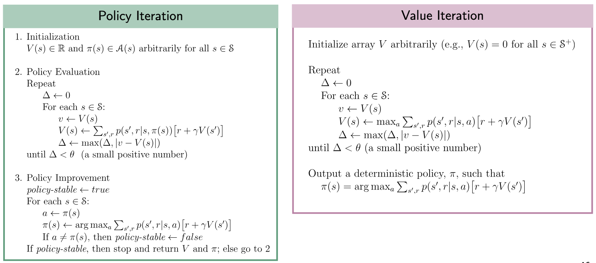

# [State Space Search](https://en.wikipedia.org/wiki/State_space_search)

## 1. Agents

- State-space representation

## 2. Blind / Uninformed Search

### 2.1. DFS

### 2.2. BFS

### 2.3. UCS

## 3. Informed Search

### 3.1. A\*

## 4. Constraint Satisfaction Problems, SAT Solving & Logic

- Backtracking, backtrack variants, intelligent and dependency directed backtracking
- Arc consistency techniques
- hybrid constraint propagation methods

## 5. Game Trees

### 5.1. Minimax

### 5.2. Alpha-Beta Pruning

## 6. Uncertainty in Game Trees

### 6.1. Expectimax

## 7. Markov Decision Processes

- States $S$
- Actions $A$
- Rewards $R(s, a, s')$
- Transition probabilities $T(s, a, s') = P(s' \mid s, a)$
- Policy $\pi(s) = \arg \max_a{Q(s, a)}$, where
  - Q-value $Q(s, a) = \sum_{s'}{T(s, a, s') \big( R(s, a, s') + \gamma V(s') \big)}$ (weighted average of the rewards at $s'$), where
    - State value $V(s) = \max_a{Q(s, a)} = \max_a{\sum_{s'}{T(s, a, s') \big( R(s, a, s') + \gamma V(s') \big)}}$

Note: this is not a linear set of equations. Therefore, value iteration: $V_0(s) = 0, \, V_{k+1}(s) = \max_a{Q(s, a)}$

States: [(1, 1), (1, 2), (1, 3),
(2, 1), (2, 2), (2, 3),
(3, 1), (3, 2), (3, 3)]
Current state $s$ = (2, 2)
Actions: [N, E, S, W]
Rewards:

- $R(s, a, s'=(1, 1)) = 8$
- $R(s, a, s'=(1, 2)) = 15$
- $R(s, a, s'=(1, 3)) = 12$
- $R(s, a, s'=(2, 1)) = 2$
- $R(s, a, s'=(2, 3)) = 10$
- $R(s, a, s'=(3, 1)) = 7$
- $R(s, a, s'=(3, 2)) = 16$
- $R(s, a, s'=(3, 3)) = 11$

Transition probabilities:

- $T(s, a, s' = \text{intended}) = P(s' \mid s, a) = 0.7$
- $T(s, a, s' = \text{left}) = P(s' \mid s, a) = 0.1$
- $T(s, a, s' = \text{right}) = P(s' \mid s, a) = 0.2$

Q-values (with $R = 0, \gamma = 1$):

- $Q(s, a = N) = \sum_{(1, 1), (1, 2), (1, 3)}{T(s, a = N, s') \big( R(s, a = N, s') + \gamma V(s') \big)}$
- ...

Reinforcement learning can be viewed as a Markov decision process (MDP), having the following properties:

- Set of states $S$
- Set of actions $\text{Actions}(S)$
- Transition model $P(s’ \mid s, a)$
- Reward function $R(s, a, s’)$

The transition model gives us the new state after performing an action, and the reward function is what kind of feedback the agent gets.

## 8. Planning

## 9. Genetic Algorithms and Evolutionary Computation

High-level contents and materials

    - Lecture 1: Introduction
    - Lecture 2: Problems, representation, and variation
    - Lecture 3: Population management
    - Online module 1: Local search operators
    - Online module 2: Multiobjective optimization and diversity promotion
    - Online case study modules: Hands-on programming exercises

Detailed contents

Basics of evolutionary algorithms

    - Exploration versus exploitation
    - Computational and optimization problems
    - Objective function
    - Representation
    - Constraints
    - Variation operators
    - Selection and elimination operators
    - Hyperparameter self-adaptivity

Local search operators

    - Steepest descent
    - Monte Carlo sampling
    - k-opt

Multi-objective optimization and diversity promotion

    - Crowding
    - Island model
    - Fitness sharing
    - Scalarization (fixed tradeoff)
    - Pareto front

## 10. Reinforcement Learning

- **Model-Free**:
  - _Value-Based_:
    - Tabular Methods:
      - On-Policy: TD(0) [p. 119], SARSA [p. 129], MC Control (first-visit) [p. 92]
      - Off-Policy: Q-Learning [p. 131]
    - Semi-Gradient Methods:
      - On-Policy: TD(0) [p. 119], SARSA[p. 129]
      - Off-Policy: Q-Learning [p. 131]
    - Deep Methods:
      - On-Policy: DQN, Double DQN
  - _Policy-Based_:
    - Deep / Value Function Approximations:
      - On-Policy: REINFORCE [\*, p. 326], REINFORCE with Baseline [\*, p. 329]
  - _Value and Policy-Based_:
    - Actor-Critic:
      - Semi-Gradient Methods:
        - On-Policy: Actor-Critic with semi-gradient TD(0) [p. 332]
      - Deep Methods:
        - On-Policy: A3C (or A2C) [\*], TRPO [\*], PPO [\*]
        - Off-Policy: DDPG [\*], SAC [\*]
- **Model-Based**:
  - _Access to Model_:
    - Dynamic Programming: Exhaustive Search [p. 62], Policy Iteration [p. 80], Value Iteration [p. 82]
    - Planning: MCTS [p. 185]
    - Deep Methods: Alpha Zero
  - _Learn Model_:
    - Dyna: Dyna-Q [p. 161], Dyna-AC
    - Deep Methods: World Models, Dreamer

\* = Continuous Action Space is possible

### 1. Introduction to Planning and Reinforcement Learning

Reinforcement learning: _Agent_ learning to achieve a goal, solve sequential decision problems, via repeated _interaction_ with the (dynamic) _environment_.

RL and planning:

- RL problem: efficiently learn a high-value policy by interacting with an MDP.
- Planning problem: given an MDP (we know all of its components, $(\mathcal{S}, \mathcal{A}, p)$), compute the optimal policy $\pi$.

**Reward hypothesis**: All goals can be described by the maximisation of the expected value of cumulative scalar rewards.

- Manage investment portfolio: reward?
- Make humanoid robot walk: reward?

TODO: read <https://www.sciencedirect.com/science/article/pii/S0004370221000862?via%3Dihub>

Elements of a RL System:

- Reward signal (given)
- Policy (learned)
- Value function (learned)
- Model (of the environment; learned)

#### 1.1. Scope and Limitations

Machine Learning = improving performance with experience (data).

- In supervised learning, the training signal is _instructive_, i.e. "which is the correct action, independently of the one taken?"
- In RL, the training signal is **evaluative**, i.e. "how good is the action taken?", and can only be learned by trial and error.

Beyond Tic-Tac-Toe:

- RL works perfectly also with multiple agents or when there is no opponent at all (vs. nature): as long as you can encode the goal in a reward, there is no need for an opponent.
- RL works also for problems with a large number of states: Tic-Tac-Toe has $3^9 \approx 20k$ states, Go $3^{361} >$ the number of atoms in the universe.
- RL can also be used when we can't foresee the effect of our actions.
- RL works with any amount of prior knowledge we have on the problem.

Key challenges:

- _Unknown environment_: How do actions affect environment state and rewards?
- _Exloration-exploitation dilemma_.
- _Delayed rewards_: Which prior action(s)' long-term consequences led to the reward?

### 2. Multi-Armed Bandits (MAB)

Simplest RL problem: the **Multi-Armed Bandit Problem**:

- Given: a set of $k$ actions, $\mathcal{A}$, the agent can take, rewards from the environment distributed according to a **stationary** _probability distribution_, $p(r \mid a)$ number of rounds $T$.
- Repeat for $t$ in $T$ rounds:
  1. Algorithm selects arm $A_t \in \mathcal{A}$.
  2. Algorithm observes reward $R_t \in [0, 1]$.
- Goal: maximise expected long-term total reward.
  - Value of arm: expected reward given action taken $q_*(a) \doteq \mathbb{E}[R_t \mid A_t = a] \, \big(= \sum_r{p(r \mid a) r} \big)$.
  - If we knew the action values with certainty, we would select the action with the maximal value. The true value $q_*$ is unknown to the agent, so compute _estimates_ $Q_t(a)$.

An action-value method requires two tasks:

1. How to _estimate the values_ of actions, i.e. how to compute $Q_t(a)$.
2. How to use the estimates to make an _action selection decision_, i.e. given $Q_t(a)$ how to select $A_t$.

Action-value _estimation_ methods:

- Sample average.
- Exponential recency-weighted average method.

Action _selection_ methods:

- Pure greedy.
- $\epsilon$-greedy.
- UCB.

**1. Sample-Average Estimation Method**: Estimate the value of each arm:

$$Q_t(a) \doteq \frac{\text{sum of the rewards when } a \text{ taken prior to } t}{\text{number of times } a \text{ taken prior to } t} = \frac{\sum_{i=1}^{t-1}{R_i \mathbb{1}_{A_i = a}}}{\sum_{i=1}^{t-1}{\mathbb{1}_{A_i = a}}}$$

Same equation, different notation:

$$Q_t(a) = \frac{1}{N_t(a)} \sum_{\tau = 1}^{t-1}{R_\tau \cdot \mathbb{1}_{A_t = a}}$$

_Sample averages converge in the limit_: $\lim_{N_t(a) \rarr \infty}{Q_t(a)} = q_*(a)$.

**2. (Greedy) Action Selection Method**: Select the best action $A_t$ given action-value estimates $Q_t(a)$:

- Exploit: Greedy action selection $A_t = A_t^* \doteq \argmax_a{Q_t(a)}$.
- Explore: Random action selection $A_t \sim \text{Unif}(\mathcal{A})$.

**Incremental Learning Rule** - more computationally efficient: Sample average $Q_n = \frac{R_1 + R_2 + \dots + R_{n-1}}{n-1}$ (focusing on a single action) can be computed incrementally to avoid recomputing: $Q_{n+1} = Q_n + \frac{1}{n} [R_n - Q_n]$. (This is the standard form for update rules in RL: NewEstimate <- OldEstimate + StepSize[Target - OldEstimate].)

**Non-Stationary Problems**: Suppose the true _action values shift over time_ (like in the real world). Sample average alone is no longer appropriate (TODO: why?). We should weight more recent rewards higher!

Solution: **Exponential recency-weighted average method**: instead of using the average (from the sample average), track action values using a _constant step-size parameter_ $\alpha \in (0, 1]$: $Q_{n+1} \doteq Q_n + \alpha [R_n - Q_n]$ and unrolling $Q_{n+1} = \alpha R_n + (1 - \alpha) \alpha R_{n-1} + (1 - \alpha)^2 \alpha R_{n-2} + \dots$. Recent rewards are exponentially more important!

**Stochastic Approximation Convergence Conditions**: Estimates $Q_n$ will converge with probability $1$ to $q_*$ if $\sum_{n=1}^\infty{\alpha_n(a)} \rarr \infty$ and $\sum_{n=1}^\infty{\alpha_n^2(a) < \infty}$.

- Conditions hold: $\alpha_n = \frac{1}{n}$.
- Conditions don't hold: $\alpha_n = c, \alpha_n = \frac{1}{n^2}$.

#### 2.1. Exploration vs. Exploitation

- Exploit: Pick best option so far.
- Explore: Learn more about other options.

**Exploration-Exploitation Dilemma**:

- Exploiting, i.e. selecting the maximal action value, is the right thing to do to maximise the expected reward at the current time step.
- Exploring is the right thing to do to maximise the expected reward _in the long run_ - but requires _time_.

Pursuing only one = failure. The more time you have, the more you can afford to explore - but there is no right answer.

#### 2.2. Rewards and Regret

##### 2.2.1. The problem of the sparse reward

##### 2.2.2. Introduction to advanced exploration techniques: curiosity and empowerment in RL

##### 2.2.3. Introduction to curriculum learning to facilitate the learning of the goal

##### 2.2.4. Hierarchical RL to learn complex tasks

##### 2.2.5. The learning of Universal Value Functions and Hindsight Experience Replay (HER)

#### 2.3. Greedy Algorithms

$\epsilon$**-Greedy Action Selection Algorithm** (greedy: $\epsilon = 0$; optimism = set $Q_1$ high, realism = $Q_1 = 0$):

- $Q_1(a), N_1(a) = 0, \, \forall a \in \mathcal{A}$
- For each round $t$ in $T$:
  - $A_t = \begin{cases}A_t^* & \text{Pr } 1 - \epsilon \\ \text{Unif}(\mathcal{A}) & \text{otherwise} \end{cases}$
  - Execute $A_t$, observe $R_t$.
  - Update $N_t(a), Q_t(a)$.

#### 2.4. Upper Confidence Bounds (UCB)

Greedy action-selection selects actions that look best now but does not explore actions that could be better in the long run. $\epsilon$-greedy action selection tries also non-greedy actions but it explores _indiscriminately_.

**UCB Action-Selection Algorithm**: Takes into account both optimality, i.e. greedy, and uncertainty, i.e. not explored enough yet, of action values.

- $Q_1(a), N_1(a) = 0, \, \forall a \in \mathcal{A}$
- For each round $t$ in $T$:
  - $A_t = \begin{cases}\text{Unif}(\mathcal{A}) & \max_a{N_t(a) = 0} \\ \argmax_a{\bigg[Q_t(a) + c \sqrt{\frac{\ln{t}}{N_t(a)}}\bigg]} & \text{otherwise} \end{cases}$
  - Execute $A_t$, observe $R_t$.
  - Update $N_t(a), Q_t(a)$.

Note:

- The uncertainty $\sqrt{\frac{\ln{t}}{N_t(a)}}$ is
  - reduced each time we select $a$: $N_t(a) = N_{t-1}(a) + 1$.
  - increased each time another action is selected: same $N_t(a)$ but $\ln{t}$ increases.
- Estimate + (positive) uncertainty $\approx$ upper bound.
- $c$ is the confidence on this upper bound; $c = 0$ is equivalent to being greedy.

_When the uncertainty of an action $a$'s value is high, UCB considers $a$ to potentially have a higher true value than its current estimate_.

TODO: read UCB paper: P. Auer, N. Cesa-Bianchi, P. Fischer (2002). Finite-time analysis of the multi-armed bandit problem. Machine Learning, 47(2-3), 235-256.

### 3. Markov Decision Processes (MDPs)

_Bringing State Back_: The **Agent-Environment Interface**: Agent and environment interact at discrete time steps $t = 0, 1, 2, 3, \dots$:

- The best action for the agent may depend on the state.
- The actions may influence future states and rewards.

Markov Decision Process: the canonical way to model RL problems:

- Policy: $\pi$ is a strategy for assigning actions to states.
- Long term view of the quality of a policy: Value $v_\pi(s)$, Action-value $q_\pi(s, a)$ capture expected cumulative discounted reward
- Goal: Find a policy that maximises value.

The RL **environment** with an MDP is characterised completely by: transition function $p(s' \mid s, a)$, reward function $r(s, a)$ which constitute the _dynamics_ of the MDP.

Given an MDP, $(\mathcal{S}, \mathcal{A}, p, r)$, the quantities of interest are:

- Policy $\pi(a \mid s)$.
- Discount factor $\gamma \in [0, 1)$.
- Return $G_t = \sum_{k=0}^\infty{\gamma^k R_{t+1+k}}$.
- State-value $v_\pi(s) = \mathbb{E}_\pi[G_t \mid S_t = s]$.
- Action-value $q_\pi(s, a) = \mathbb{E}_\pi[G_t \mid S_t = s, A_t = a]$.

Reward is enough, D. Silver et al., 2021: All of what we mean by _goals_ and purposes can be well thought of as the _maximisation_ of the _expected value_ of the _cumulative sum_ of a scalar signal, called _reward_.

Goals and **rewards**: Rewards indicate the goal / purpose, not the strategy; that is, rewards indicate the WHAT not the HOW. The agent otherwise could focus on the intermediate steps and forget about the real goal: winning.

A **policy** is the agent's strategy for assigning actions to states: $\pi: \mathcal{S} \rarr \mathcal{A}$ (can be stochastic too). The _goal_ is to find a policy that maximises expected cumulative reward. The _value_ $v_\pi(s)$ and _action-value_ $q_\pi(s, a)$ capture the expected cumulative discounted reward.

**Markov property**: Future states and rewards are independent of past states and actions, given the current state and action: state $S_t$ is a sufficient summary of interaction history.

#### 3.2. Policies and value functions

An MDP is controlled with a **policy**: $\pi(a \mid s)$ is the probability of selecting $a$ when in state $s$ under policy $\pi$.

- Special case: deterministic policy $\pi(s) = a$, e.g. `high -> search, low -> recharge`.
- An MDP coupled with a fixed policy $\pi$ is a _Markov chain_.

The **state-value function** $v$ of a state $s$ under a policy $\pi$, $v_\pi$, is the expected return when starting in $s$ at timestep $t$ and following $\pi$ from there on:

$$v_\pi(s) \doteq \mathbb{E}_\pi[G_t \mid S_t = s] = \mathbb{E}_\pi\bigg[ \sum_{k=0}^\infty{ \gamma^k R_{t+k+1} \mid S_t = s } \bigg]$$

If we want to evaluate a policy, we compute its value functions!

Agent’s goal is to learn a policy that maximises cumulative reward.

- Assuming _terminating episodes_, e.g. can enforce termination by setting number of allowed time steps.
- For non-terminating (infinite) episodes, can use **discount rate** $\gamma \in [0, 1)$, e.g. financial portfolio management, one cookie now or many later?
  - Low $\gamma$ is shortsighted.
  - High $\gamma$ is farsighted.
  - A reward received $k$ timesteps in the future is only worth $\gamma^{k-1}$ times what it would be worth if it was received immediately.

$$G_t \doteq \sum_{k=0}^\infty{\gamma^k R_{t+1+k}}$$

This sum is _finite_ for $\gamma < 1$ and _bounded_ for rewards $R_t \leq r_\text{max}$:

$$\sum_{k=0}^\infty{\gamma^k R_{t+1+k}} \leq r_\text{max} \sum_{k=0}^\infty{\gamma^k} = r_\text{max} \frac{1}{1 - \gamma}$$

And the definition also works for terminating episodes if terminal are **absorbing**: an absorbing state always transitions into itself and gives reward zero.

#### 3.1. Bellman Equations

By virtue of the Markov property, the **state-value** and **action-value** functions can be written in recursive form (i.e. a look-ahead tree):

$$
v_\pi(s) \doteq \mathbb{E}[G_t \mid S_t = s]
= \sum_a{ \pi(a \mid s) \sum_{s', r}{ p(s', r \mid s, a) [r + \gamma v_\pi(s')] } }
$$

$$q_\pi(s, a) \doteq \mathbb{E}_\pi[G_t \mid S_t = s, A_t = a] = \sum_{s', r}{ p(s', r \mid s, a) [r + \gamma v_\pi(s')] }$$

Both equations represent the sum of the _immediate reward plus the discounted expectd future value_ ($\mathbb{E}_{s'}[v_\pi(s')] = \sum_{s' \in \mathcal{S}}{ p(s' \mid s, a) \cdot v_\pi(s') }$):

$$v_\pi(s) = \sum_{a \in \mathcal{A}}{\pi(a \mid s) r(s, a) + \gamma \sum_{s' \in \mathcal{S}}{ p(s' \mid s, a) \cdot v_\pi(s') }}$$

$$q_\pi(s, a) = r(s, a) + \gamma \sum_{s' \in \mathcal{S}}{ p(s' \mid s, a) \cdot v_\pi(s') }$$

#### 3.3. Optimality

**Bellman optimality equations**: A policy $\pi$ is optimal if (can be expressed without reference to policy):

$$
v_\pi(s) = v_*(s) = \max_{\pi'}{v_{\pi'}(s)}
= \max_a{ \sum_{s', r}{ p(s', r \mid s, a) [r + \gamma v_*(s')] } }
$$

$$q_\pi(s, a) = q_*(s, a) = \max_{\pi'}{q_{\pi'}(s, a)} = \sum_{s', r}{ p(s', r \mid s, a) [r + \gamma \max_{a'}{q_*(s', a')}] }$$

By the Bellman Equation, this implies that for any optimal policy: $\forall \hat{\pi}, s: v_\pi(s) \geq v_{\hat{\pi}}(s)$.

What can be said about the value, $v_\pi(s)$ of a policy $\pi$ when $\gamma=0.5$ vs. $\gamma=0.9$? When are they equal, if ever?

- With $\gamma=0.5$, future rewards are discounted more aggressively. The agent focuses more on immediate rewards and less on long-term returns.
- With $\gamma=0.9$, the agent considers long-term rewards more significantly. A higher $\gamma$ generally leads to a larger $v_\pi(s)$, assuming rewards are positive.
- If all future rewards beyond the immediate step are zero, then $\gamma$ has no effect, and the value functions are equal: This happens in episodic tasks that end immediately.

The Bellman optimality equation for $v_\pi$ forms a system of $n = \lvert \mathcal{S} \rvert$ linear equations with $n$
variables (for finite MDPs): $v_\pi(s_1) = \dots, v_\pi(s_2) = \dots, \dots, v_\pi(s_n) = \dots$

- The optimal value function $v_\pi$ is the unique solution to the system.

The Bellman optimality equation for $v_∗$ forms a system of $n$ non-linear equations with $n$ variables (for finite MDPs):

- Equations are non-linear due to the $\max$ operator.
- The optimal value function $v_∗$ is the unique solution to the system.

Have we solved RL? We are making two assumptions: we have $p(s', r \mid s, a)$, we have engouh computational power. DP, for example, provides an approximate solution to the Bellman equations.

#### 3.4. Partial and full observability

#### 3.5. Ergodicity, Discounting and Average Reward

For finite MDPs and non-terminating episodes, any policy $\pi$ will produce an **ergodic** set of states $\hat{\mathcal{S}}$:

- Every state in $\hat{\mathcal{S}}$ is visited infinitely often.
- Steady-state distribution $P_\pi(s) = \lim_{t \rarr \infty}{ \text{Pr}\{ S_t = s \mid A_0, \dots, A_{t-1} \sim \pi \} }$.

Policy performance can be measured by **average reward**, independent of initial state $S_0$!

$$
r(\pi) \doteq \lim_{h \to \infty} \frac{1}{h} \sum_{t=1}^{h} \mathbb{E} [ R_t \mid S_0, A_0, ..., A_{t-1} \sim \pi]
= \sum_{s} P_{\pi}(s) \sum_{a} \pi(a | s) \sum_{s', r} p(s', r | s, a) r
$$

Maximising discounted return over the steady-state distribution is the same as maximising average reward - $\gamma$ has no effect on the maximisation!

$$\sum_{s} P_{\pi}(s) v_{\pi}(s) = \sum_{s} P_{\pi}(s) \sum_{a} \pi(a | s) \sum_{s',r} p(s', r | s, a) [r + \gamma v_{\pi}(s')]$$

$$= r(\pi) + \sum_{s} P_{\pi}(s) \sum_{a} \pi(a | s) \sum_{s',r} p(s', r | s, a) [\gamma v_{\pi}(s')]$$

$$= r(\pi) + \gamma \sum_{s'} P_{\pi}(s') v_{\pi}(s')$$

$$= r(\pi) + \gamma \left[ r(\pi) + \gamma \sum_{s'} P_{\pi}(s') v_{\pi}(s') \right]$$

$$= r(\pi) + \gamma r(\pi) + \gamma^2 r(\pi) + \gamma^3 r(\pi) + \cdots$$

$$= r(\pi) \frac{1}{1 - \gamma} \quad \Rightarrow \quad \gamma \text{ has no effect on maximisation!}$$

Focus on discounted returns:

- Most of current RL theory was developed for discounted returns.
- Discounted and average return settings both give the same limit results for $\gamma \rarr 1$, which is why people often use $\gamma \in [0.95, 0.99]$.
- Discounted returns work well for finite and infinite episodes.

TODO: read Tsitsiklis, J., Van Roy, B. (2002). On Average Versus Discounted Reward Temporal-Difference Learning. Machine Learning 49, 279-191.

### 4. Dynamic Programming

Planning: Solving an MDP.

- Given: an MDP $(\mathcal{S}, \mathcal{A}, p, r, \gamma)$.
- Output: an optimal policy $\pi_* = \argmax_\pi{v_\pi(s), \, \forall s}$.

DP: use Bellman Equations to organise search for good policies.

Algorithms for solving MDPs: policy iteration, value iteration.

#### 4.1. Policy Iteration

1. Evaluation (E): compute the $n = \lvert S \rvert$ values $v_\pi(s)$ for $\pi$.
   - Gaussian elimination has complexity $\mathcal{O}(n^3)$.
2. Improvement (I): make policy $\pi$ greedy w.r.t. $v_\pi$:

$$\pi'(s) = \argmax_a{q_\pi(s, a)} = \argmax_a{ \sum_{s', r}{ p(s', r \mid s, a) [r + \gamma v_k(s')] } }$$

Process converges to optimal policy!

##### Iterative Policy Evaluation

1. Initialise $v_0(s) = 0$.
2. Update $v_k \rarr v_{k+1}$ for each state $s$:

$$v_{k+1}(s) = \sum_a{ \pi(a \mid s) \sum_{s', r}{ p(s', r \mid s, a) [r + \gamma v_k(s')] } }$$

The sequence converges to $v_\pi$ - stop when converged.

##### Policy Improvement Theorem

Let $\pi, \pi'$ be policies s.t. $\forall s, \, \sum_a{ \pi'(a \mid s) q_\pi(s, a) \geq \sum_a{ \pi(a \mid s) q_\pi(s, a) } } = v_\pi(s)$.

Then $\pi'$ must at least as good or better than $\pi$:

$$\forall s: v_{\pi'}(s) \geq v_\pi(s)$$

_Proof for deterministic policies_:

$$v_{\pi}(s) \leq q_{\pi}(s, \pi'(s))$$

$$= \mathbb{E}_{\pi'} \big[ R_{t+1} + \gamma v_{\pi}(S_{t+1}) \mid S_t = s, A_t = \pi'(s) \big]$$

$$= \mathbb{E}_{\pi'} \big[ R_{t+1} + \gamma v_{\pi}(S_{t+1}) \mid S_t = s \big]$$

$$\leq \mathbb{E}_{\pi'} \big[ R_{t+1} + \gamma q_{\pi}(S_{t+1}, \pi'(S_{t+1})) \mid S_t = s \big] \quad \text{(by premise)}$$

$$= \mathbb{E}_{\pi'} \big[ R_{t+1} + \gamma \mathbb{E}_{\pi'} [ R_{t+2} + \gamma v_{\pi}(S_{t+2}) \mid S_{t+1}, A_{t+1} = \pi'(S_{t+1}) ] \mid S_t = s \big]$$

$$= \mathbb{E}_{\pi'} \big[ R_{t+1} + \gamma R_{t+2} + \gamma^2 v_{\pi}(S_{t+2}) \mid S_t = s \big]$$

$$\leq \mathbb{E}_{\pi'} \big[ R_{t+1} + \gamma R_{t+2} + \gamma^2 R_{t+3} + \gamma^3 v_{\pi}(S_{t+3}) \mid S_t = s \big]$$

$$\vdots$$

$$\leq \mathbb{E}_{\pi'} \big[ R_{t+1} + \gamma R_{t+2} + \gamma^2 R_{t+3} + \gamma^3 R_{t+4} + \dots \mid S_t = s \big]$$

$$= v_{\pi'}(s)$$

#### 4.2. Value Iteration

Iterative policy iteration may take many sweeps $v_k \rarr v_{k+1}$ to converge. Do we have to wait until convergence before policy improvement?

Iterative policy evaluation uses Bellman equation as operator: $v_{k+1}(s) = \sum_a{ \pi(a \mid s) \sum_{s', r}{ p(s', r \mid s, a) [r + \gamma v_k(s')] } } \quad \forall s \in \mathcal{S}$. Value iteration combines one sweep of iterative policy evaluation and policy improvement by using _Bellman optimality equation_ as operator:

$$v_{k+1}(s) = \max_a{ \sum_{s', r}{ p(s', r \mid s, a) [r + \gamma v_k(s')] } } \quad \forall s \in \mathcal{S}$$

Sequence converges to optimal policy (can show that Bellman optimality operator is $\gamma$-contraction).

#### 4.3. Asynchronous DP

Performiing policy evaluation and improvement for all states is prohibitive if the state space is large.

Asynchronous DP methods evaluate and improve policy on subset of states:

- Gives flexibility to choose best states to update, e.g. random states, recently visited states (real-time DP).
- Parallelisation (on multiple processors).
- Still guaranteed to converge to optimal policy if all states in $\mathcal{S}$ are updated infinitely many times in the limit.

#### 4.4. Generalised Policy Iteration

#### 4.5. Efficiency of DP

TODO: read <https://arxiv.org/pdf/1302.4971>

### 5. Monte Carlo Methods

DP methods iterate through policy evaluation and
improvement until convergence to optimal value
function $v_∗$ and policy $\pi_∗$:

- Policy evaluation via repeated application of
  Bellman operator.
- Requires complete knowledge of MDP model: $p(s', r \mid s, a)$.

Can we compute optimal policy without knowledge of complete model?

#### 5.1. MC Prediction

#### 5.2. MC Estimation of Action Values

#### 5.3. MC Control

#### 5.4. MC Control without Exploring States

#### 5.5. Off-policy Prediction via Importance Sampling

#### 5.6. Incremental Implementation

#### 5.7. Off-policy Control

#### 5.8. Discounting-Aware Importance Sampling

#### 5.9. Per-Decision Importance Sampling

### 6. Temporal-Difference Learning

#### 6.1. TD Prediction

Advantages, Optimality of TD(0)

#### 6.2. Sarsa: On-policy TD Control

#### 6.3. Q-learning: Off-policy TD Control

#### 6.4. Expected Sarsa

#### 6.5. Maximisation Bias and Double Learning

#### 6.6. Games, Afterstates, and Other Special Cases

### 8. n-Step bootstrapping

### 8. Planning and learning with tabular methods

#### 8.1. Dyna: integrated planning, acting and learning

#### 8.2. Real time dynamic programming

#### 8.3. Monte-Carlo tree search

### 9. Approximate methods

#### 9.1. Value function approximation

#### 9.2. Gradient methods

#### 9.3. On-policy and off-policy variants

### 10. Policy gradient methods

#### 10.1. Policy approximation

#### 10.2. Policy gradients

##### 10.2.1. What to do in continuous action spaces

##### 10.2.2. How probabilistic policies allow to apply the gradient method directly in the policy network

##### 10.2.3. The REINFORCE algorithm

##### 10.2.4. The Actor-Critic algorithms

##### 10.2.5. State-of-the-art algorithms in continuous action spaces: DDPG, TD3 and SAC

#### 10.3. Actor Critic

### 11. Contemporary topics

#### 11.1. Deep Reinforcement learning

##### 11.1.1. Dealing with the deadly triad with the DQN algorithm

##### 11.1.2. Application to the Atari games case

##### 11.1.3. Evolutions of the DQN algorithm: Double DQN, Prioritized Experience Replay, multi-step learning and Distributional value functions

##### 11.1.4. Rainbow: the state-of-the-art algorithm in discrete action space

#### 11.2. Multi-agent reinforcement learning

##### 11.2.1. Learning of behaviours in environments with several agents

##### 11.2.2. Learning of cooperative behaviours, Learning of competitive behaviours, and mixed cases

##### 11.2.3. State-of-the art algorithms

##### 11.2.4. The special case of games: The Alpha-Go case and the extension to Alpha-Zero

#### 11.3. Shielding and safe reinforcement learning

#### 11.4. Relational reinforcement learning and traditional planning

#### 11.5. Towards life-long learning in agents

- Is RL a way to obtain a General Artificial Intelligence?
- Multi-task learning in RL, Transfer learning in RL and Meta-learning in RL.

### 12. Psychology

### 13. Neuroscience

### 14. Applications in game playing and beyond

### 15. Frontiers

## References

Abbeel, P. (2014). CS188 Intro to AI [Course materials]. UC Berkeley. Retrieved from <https://ai.berkeley.edu/home.html>

Finn, C. (2025). CS 224R Deep Reinforcement Learning [Course materials]. Stanford University. Retrieved from <http://cs224r.stanford.edu/>

Malan, D., & Yu, B. (2024). CS50’s Introduction to Artificial Intelligence with Python [Course materials]. Harvard OpenCourseWare. Retrieved from <https://cs50.harvard.edu/ai/2024/notes/3/>

Sutton, R. S., & Barto, A. G. (2018). Reinforcement learning: An introduction (2nd ed.). MIT Press.
