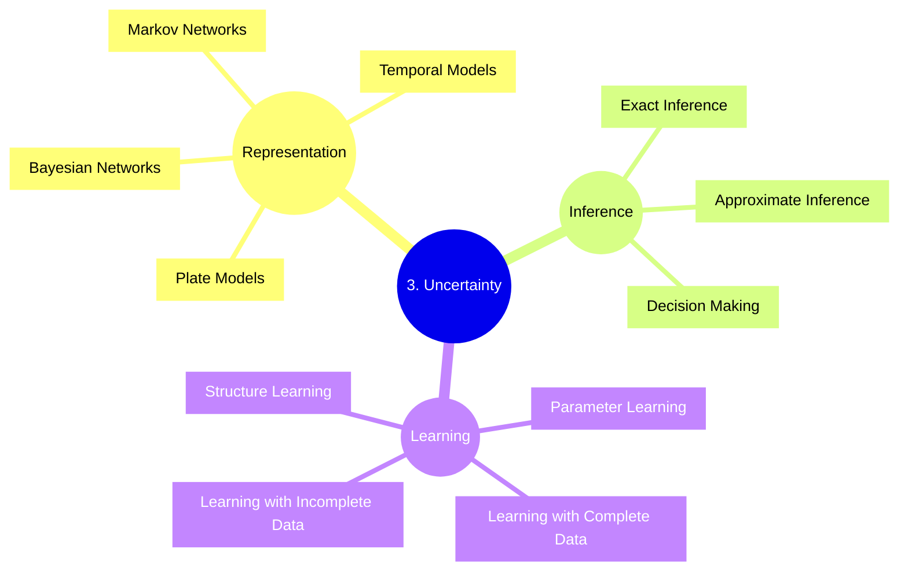

# Uncertainty

1. Representation: Formal definition
   - Bayesian probability theory: modelling, inference, reasoning, decision making under uncertainty
   - Graphical models: directed and undirected; Bayesian networks, Markov Networks and Factor Graphs
   - Time series, including hidden Markov models and state-space models
   - Independence in graphical models
2. Inference: Answering probabilistic queries (exactly and approximately)
   - Inference algorithms: singly-connected graphs, Hidden Markov Models, message passing, belief propagation
   - Approximate Inference using Sampling
3. Learning: Learning parameters and structure of graphical model from data
   - Learning from fully observable data
   - Learning from partially observable data
     - The Expectation-Maximisation (EM) algorithm
   - Combining logic with graphical models
   - Applications

A **model** is a _declarative_ representation of a problem, which can be solved by applying different algorithms for inference or learning from data.

Given random variables $X_1, \dots, X_n$, a _joint distribution_ $P(X_1, \dots, X_n)$ is a binary distribution over $2^n$ possible states.

A **graphical representation** provides an _intuitive and compact data structure_ for _efficient reasoning_ using general-purpose algorithms given _sparse parametrisation_ (for feasible elicitation, and learning from data).

A **factor** $\phi$ is a function, or a table, that takes a set of random variables $X_1, \dots, X_n$ as arguments, and gives a value for every assignment to those random variables. The variables in its domain are called its _scope_; e.g., factor _product_ $f(A, B, C, D) = \phi(A, B, C) \times \phi(C, D)$ has scope $\{A, B, C, D\}$. Other operations on factors include factor _marginalisation_, and factor _reduction_.

## 1. Representation

### 1.1. Bayesian Networks: Directed Models

A Bayesian Network is a directed acyclic graph (DAG) $G$ whose nodes represent (a joint distribution over) the random variables $X_1, \dots, X_n$ - which factorises over $G$:

$$P(X_1, \dots, X_n) = \prod_i P(X_i \mid \text{Parents}_G(X_i)) \quad \text{(by the chain rule)}$$

where $P(X_i \mid \text{Parents}_G(X_i))$ is the _conditional probability distribution (CPD)_ for each node $X_i$.

A BN is a legal probability distribution:

- $P \geq 0$. Proof: $P$ is a product of (conditional) PDs, which are non-negative by definition; hence it is non-negative.
- $\sum P = 1$. Bucketing: $\sum_{D, I, G, S, L} P(D, I, G, S, L) = \sum_{D, I, G, S, L} P(D) P(I) P(G \mid I, D) P(S \mid I) P(L \mid G) = \sum_{D} P(D) \sum_{I} P(I) \sum_{G} P(G \mid I, D) \sum_{S} P(S \mid I) \sum_{L} P(L \mid G) = 1$.

#### 1.1.1. Reasoning

- Causal
- Intercausal

A trail $X_1 - \dots - X_n$ is active if

- it has no v-structures $X_{i-1} \rightarrow X_i \leftarrow X_{i+1}$ blocking it.

A trail $X_1 - \dots - X_n$ is active given $Z$ if

- for any v-structure $X_{i-1} \rightarrow X_i \leftarrow X_{i+1}$, $X_i$ or one of its descendants $\in Z$, and
- no other $X_i \in Z$.

#### 1.1.2. Independencies

$$
\begin{aligned}
  X \perp Y
  & \iff P(X, Y) = P(X) P(Y) \\
  & \iff P(X \mid Y) = P(X) \\
  & \iff P(Y \mid X) = P(Y)
\end{aligned}
$$

$$
\begin{aligned}
  X \perp Y \mid Z
  & \iff P(X, Y \mid Z) = P(X \mid Z) P(Y \mid Z) \\
  & \iff P(X \mid Y, Z) = P(X \mid Z) \\
  & \iff P(Y \mid X, Z) = P(Y \mid Z)
\end{aligned}
$$

#### 1.1.3. Template Models

Examples: Genetic inheritance, NLP sequence models, image segmentation.

A **template variable** $X(U_1, \dots, U_k)$ is instantiated (duplicated) multiple times, and hence indexed by an index:

- Location(t), Sonar(t)
- Genotype(person), Phenotype(person)
- Label(pixel)
- Difficulty(course), Intelligence(student), Grade(course, student)

**Template models** are a convenient way of representing Bayesian networks that have a high amount of parameter sharing and structure. They are compact representations of a fully unrolled Bayesian network, and thus have no additional representative powers. They specify how variables inherit dependency models from the template:

- Temporal models
- Object-relational models:
  - Directed: Plate Models
  - Undirected

##### 1.1.3.1. Temporal Models

**Dynamic Bayesian Networks (DBNs)** are a compact representation for encoding structured distributions over arbitrarily long temporal trajectories, i.e. $P(X^{(t:t')})$ for any $t, t'$; based on assumptions of Markovian evolution and time invariance.

Let $\Delta$ be time granularity, $X^{(t)}$ the variable $X$ at time $t\Delta$, and the finite set of variables $X^{(t:t')} = \{X^{(t)}, \dots, X^{(t')}\}, \, t \leq t'$.

By the chain rule of probability, $P(X^{(0:T)}) = P(X^{(0)}) \prod_{t=0}^{T-1} P(X^{(t+1)} \mid X^{(0:t)})$.

Depending on the situation, one can make assumptions:

- **Markov Assumption**: $(X^{(t+1)} \perp X^{(0:t-1)} \mid X^{(t)})$.

  Hence, $P(X^{(0:T)}) = P(X^{(0)}) \prod_{t=0}^{T-1} P(X^{(t+1)} \mid X^{(t)})$.

- Assumption of **Time Invariance**: For all $t$, there exists a template transition model $P(X' \mid X)$ s.t. $P(X^{(t+1)} \mid X^{(t)}) = P(X' \mid X)$.

  Thus, a **2-Time-Slice Bayesian Network (2TBN)** is a transition model over template $X_1, \dots, X_n$ specified as a BN fragment such that:

  - The nodes include $X_1', \dots, X_n'$ and a subset of $X_1, \dots, X_n$.
  - Only the nodes $X_1', \dots, X_n'$ have parents and a CPD.
  - By the chain rule, the 2TBN defines a conditional distribution $P(X' \mid X) = \prod_{i=1}^n P(X_i' \mid \text{Parents}(X_i'))$.

A **Dynamic Bayesian Network (DBN)** over $X_1, \dots, X_n$ is defined by:

- a Bayesian Network $BN^{(0)}$ over $X_1^{(0)}, \dots, X_n^{(0)}$ defining the _initial state_, and
- a 2TBN $BN_\rightarrow$ over $X_1, \dots, X_n$ defining the _dynamics_ of the model.

For a trajectory over $0, \dots, T$ a **ground (unrolled) network** is one such that the dependency model for $X_1^{(0)}, \dots, X_n^{(0)}$ is copied from $BN^{(0)}$, and the dependency model for $X_1^{(t)}, \dots, X_n^{(t)}$ for all $t > 0$ is copied from $BN_\rightarrow$.

**Hidden Markov Models (HMMs)** can be viewed as a subcclass of DBNs whose structure typically manifests in _sparsity_ and _repeated elements within the transition matrix_, used for modelling sequences.

##### 1.1.3.1. Plate Models

A plate model is a template for an infinite set of BNs, each induced by a different set of domain objects. Parameters and structure are reused within a BN and across different BNs. Thus, models encode correlations across multiple objects, allowing collective inference.

For a template variable $A(U_1, \dots, U_k)$ and template parents $B_1(U_1), \dots, B_m(U_m)$, the template is the CPD $P(A \mid B_1, \dots, B_m)$.

#### 1.1.4. Structured CPDs

A table-based representation of a CPD in a Bayesian network has a size that grows exponentially in the number of parents. There are a variety of other form of CPD that exploit some type of structure in the dependency model to allow for a much more compact representation.

- Deterministic CPDs
- Tree-structured CPDs
- Logistic CPDs & generalisations
- Noisy OR / AND
- Linear Gaussians & generalisations

### 1.2. Markov Networks: Undirected Models

#### 1.2.1. Independencies

#### 1.2.2. Local Structure

## 2. Inference

| Marginals                | MAP                          |
| ------------------------ | ---------------------------- |
| Less fragile             | Coherent joint assignment    |
| Confidence in answers    | More tractable model classes |
| Supports decision making | Some theoretical guarantees  |

**Approximate Inference**:

| Marginals                   | MAP                                           |
| --------------------------- | --------------------------------------------- |
| Errors are often attenuated | Ability to gauge whether algorithm is working |

### 2.1. Decision Making

TODO: <https://www.coursera.org/learn/probabilistic-graphical-models/lecture/6y4uT/maximum-expected-utility>

Utility generally depends on multiple factors (money, time, chance of death, etc.) and is usually non-linear with diminishing returns. It determines an agent's attitude to risk.

### 2.2. Exact Inference

#### 2.2.1. Message Passing in a Clique Tree: Marginals

#### 2.2.2. MAP

### 2.3. Approximate Inference

Considerations in approximate inference:

- Connectivity structure: in message passing algorithms
- Strength of influence: coupling between variables can complicate both message passing and sampling
  - Opposing influences: even more so if influences are opposing
- Multiple peaks in likelihood: hill climbing algorithms may converge to local optima

#### 2.3.1. Loopy Message Passing: Marginals

#### 2.3.2. Sampling Methods: Marginals and MAP

#### 2.3.3. Search-Based Methods (incl. MCMC Sampling): MAP

## 3. Learning

From a true distribution $P^*$ (maybe corresponding to a PGM $M^*$) sample a dataset of instances $D = \{ d_1, \dots, d_M\}$.

Given some domain expertise, one can then combine learning from the dataset ($X_1, \dots, Y$) with elicitation (from the domain expertise) to form a network (with CPDs $P(Y \mid X_1, \dots)$).

HMMs: known structure, partially observed. TODO: move somewhere above in mind map

Metric for generalisation performance: **test set likelihood** $P(D' : M) = \prod_m P(d'_m : M)$

- **Underfitting = high bias**, e.g. "bias for the relationship to be a straight line even though it is not": high training and (cross) validation error.
- **Overfitting = high variance**, i.e. fails to generalise to new examples: low training error, high (cross) validation error.

Overfitting can be addressed by

- _reducing the number of features_, and
- _regularisation_, i.e. penalising large values for coefficients: $\min_\theta$ regularised training cost function $J(\theta) = \frac{1}{2m} \sum_{i=1}^m \big( h_\theta(x^{(i)}) - y^{(i)} \big)^2 + \frac{\lambda}{2m} \sum_{i=1}^n \theta_j^2 , \, \mid X \mid = m, \mid \theta \mid = n$
  - The intercept $\theta_0$ is not regularised.
  - If $\lambda$ is too large, it results in underfitting. Choose the regularisation parameter $\lambda$ by cross validation.
  - The test cost function is not regularised.

**Model selection**: Consider the model selection procedure where we choose the degree of polynomial using a cross validation set. For the final model (with parameters $\theta$), we might generally expect $J_\text{CV}(\theta)$ to be lower than $J_\text{test}(\theta)$ because an extra parameter ($d$, the degree of the polynomial) has been fit to the cross validation set.

### 3.1. Parameter Learning

#### 3.1.1. Maximum Likelihood Parameter Estimation in Bayesian Networks

Given a Bernoulli random variable $X$, i.e. $P(X = 1) = \theta, P(X = 0) = 1 - \theta$, sampled from an i.i.d. dataset, treat the continuous parameter $\theta$ as a random variable s.t. the CPD of $X$ is a function of $X$ and $\theta$.

$$
P(x_m \mid \theta) = \begin{cases}
  \theta & x_m = 1 \\
  1 - \theta & x_m = 0
\end{cases}
$$

**Maximum Likelihood Estimation (MLE)**: To find the value of $\theta \in [0, 1]$ that best fits the dataset, maximise the _likelihood_ of the dataset $D$ given $\theta$:

$$L(\theta : D) = P(D \mid \theta) = \prod_{m=1}^M P(x_m \mid \theta)$$

For example, the likelihood function given a dataset with 3 heads and 2 tails is $L\big( \theta : \langle H, T, T, H, H \rangle \big) = \theta^3 (1 - \theta)^2$.

The likelihood function is uniquely determined by sufficient statistics that summarise the dataset $D$:

- Multinomial MLE: $\hat{\theta^i} = \frac{M_i}{\sum_{i=1}^m M_i}$
- Gaussian MLE: $\hat{\mu} = \frac{1}{M} \sum_m x_m, \, \hat{\sigma} = \sqrt{\frac{1}{M} \sum_m (x_m - \hat{\mu})^2}$

By using the logarithm, the product can be turned into a summation - which is better for optimisation than multiplying numbers $\in [0, 1]$.

For Bayesian Networks with _disjoint sets of parameters_ in CPDs, likelihood decomposes as a product of _local likelihood functions_, one per variable.

For _table CPDs_, local likelihood further decomposes as a product of likelihood for multinomials, one for each parent combination.

For networks with shared CPDs, sufficient statistics accumulate over all uses of CPDs.

#### 3.1.2. Bayesian Parameter Estimation in Bayesian Networks

If $\theta$ is unknown, random variables $x_i$ are not marginally independent - each tells us something about $\theta$.

#### 3.1.3. Maximum Likelihood Parameter Estimation in (Undirected) Markov Networks

#### 3.1.3. Maximum A Posteriori Parameter Estimation in (Undirected) Markov Networks

### 3.2. Structure Learning

### 3.3. Learning with Incomplete Data

#### 3.3.1. Latent Variables

**Missing Completely at Random (MCAR)**:

**Missing at Random (MAR)**:

**Missing Not at Random (MNAR)**:

_If the missing data is missing at random (the MAR assumption holds), the likelihood of the data is independent from the missingness mechanism._

#### 3.3.2. The EM Algorithm

1. complete the data by computing expected values of weighted counts: $\mathbb{E}[L \mid X] = \sum_l{P(L = l \mid X) \text{count}(L = l)}$
2. maximise likelihood

## References

Barber, D. (2012). Bayesian Reasoning and Machine Learning. Cambridge University Press. Retrieved from <http://www.cs.ucl.ac.uk/staff/d.barber/brml/>

Deisenroth, M. (2019). Probabilistic Inference [Course materials]. Imperial College London. Retrieved from <https://www.deisenroth.cc/teaching/2018-19/probabilistic-inference/>,

Gutmann, M. (2023). Probabilistic Modelling and Reasoning [Course materials]. The University of Edinburgh. Retrieved from <https://www.inf.ed.ac.uk/teaching/courses/pmr/22-23/>

Kuleshov, V., & Ermon, S. (2024). CS 228 - Probabilistic Graphical Models [Course materials]. Stanford University. Retrieved from <https://ermongroup.github.io/cs228-notes/>

Malan, D., & Yu, B. (2024). CS50’s Introduction to Artificial Intelligence with Python [Course materials]. Harvard OpenCourseWare. Retrieved from <https://cs50.harvard.edu/ai/2024/notes/2/>
